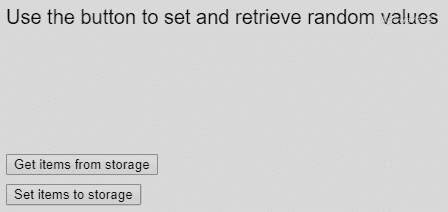

# p5.js | getItem()函数

> 原文:[https://www.geeksforgeeks.org/p5-js-getitem-function/](https://www.geeksforgeeks.org/p5-js-getitem-function/)

**getItem()** 函数用于从浏览器的本地存储器中检索已使用 storeItem()函数在给定键名下存储的值。如果找不到密钥，它将返回空值。

本地存储在浏览会话之间持续存在，并且即使在重新加载页面之后也可以存储这些值，除非它被清除。

**语法:**

```
getItem(key)
```

**参数:**该函数接受如上所述的单个参数，如下所述:

*   **键:**这是一个字符串，表示必须为其检索值的键。

**返回值:**返回存储项的值，可以是字符串、数字、布尔值、对象、p5。颜色或 p5.Vector

下面的例子说明了 p5.js 中的 **getItem()函数**:

**示例:**

```
function setup() {
  createCanvas(500, 300);
  textSize(20);
  text("Use the button to set and retrieve random values", 20, 20);

  getBtn = createButton('Get items from storage');
  getBtn.position(20, 150);
  getBtn.mouseClicked(retrieveStorage)

  setBtn = createButton('Set items to storage');
  setBtn.position(20, 180);
  setBtn.mouseClicked(setStorage)
}

function retrieveStorage() {
  clear();
  text("Use the button to set and retrieve random values", 20, 20);

  // retrieve values from local storage
  num = getItem('savedNumber');
  string = getItem('savedString');
  bool = getItem('savedBoolean');

  // display the values
  text("The retrieved items are:", 20, 40);
  text("Number: " + num, 20, 60);
  text("String: " + string, 20, 80);
  text("Boolean: " + bool, 20, 100);
}

function setStorage() {
  // generate random values
  randomNum = floor(random(100));
  randomStr = "Random String " + randomNum;
  randomBool = randomNum > 50 ? true : false;

  // store values to local storage
  storeItem('savedNumber', randomNum);
  storeItem('savedString', randomStr);
  storeItem('savedBoolean', randomBool);
}
```

**输出:**


**在线编辑:**[【https://editor.p5js.org/】](https://editor.p5js.org/)
**环境设置:**[https://www . geeksforgeeks . org/P5-js-soundfile-object-installation-and-methods/](https://www.geeksforgeeks.org/p5-js-soundfile-object-installation-and-methods/)

**参考:**T2】https://p5js.org/reference/#/p5/getItem