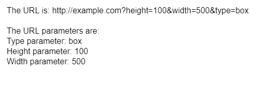
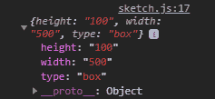

# P5 . js | geturlprams()函数

> 原文:[https://www.geeksforgeeks.org/p5-js-geturlparams-function/](https://www.geeksforgeeks.org/p5-js-geturlparams-function/)

**getURLParams()** 函数用于返回一个 JavaScript 对象的当前 URL 参数，每个参数作为该对象的一个单独成员。

**语法:**

```
getURLParams()
```

**参数:**此功能不接受任何参数。

**返回值:**返回路径参数的一个对象。

下面的例子说明了 p5.js 中的 **getURLParams()函数**:

**示例:**

```
function setup() {
  createCanvas(500, 200);

  // get the url path as array
  urlParamsObject = getURLParams();

  textSize(16);
  text("The URL is: http://example.com?height=100&width=500&type=box",
    10, 20);

  text("The URL parameters are: ", 10, 60);

  text("Type parameter: " + urlParamsObject["type"], 10, 80);
  text("Height parameter: " + urlParamsObject.height, 10, 100);
  text("Width parameter: " + urlParamsObject.width, 10, 120);

  // display the array in the console
  console.log(urlParamsObject);
}
```

**输出:**

*   **显示对象的属性:**
    
*   **在控制台中查看对象:**
    

**在线编辑:**[【https://editor.p5js.org/】](https://editor.p5js.org/)
**环境设置:**[https://www . geeksforgeeks . org/P5-js-soundfile-object-installation-and-methods/](https://www.geeksforgeeks.org/p5-js-soundfile-object-installation-and-methods/)

**参考:**T2】https://p5js.org/reference/#/p5/getURLParams