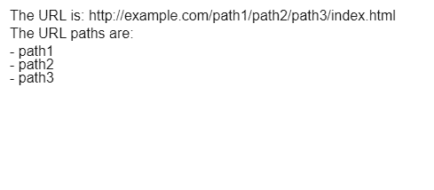
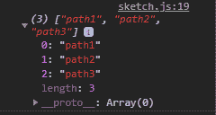

# p5.js | getURLPath()函数

> 哎哎哎:# t0]https://www . geeksforgeeks . org/P5-js-geturlpath-function/中

**getURLPath()** 函数用于以数组形式返回当前的 URL 路径，每一项都是 URL 路径的一部分。可以遍历这个数组来分别访问路径的每个部分。

**语法:**

```
getURLPath()
```

**参数:**此功能不接受任何参数。

**返回值:**返回路径组件的数组。

下面的例子说明了 p5.js 中的 **getURLPath()函数**:

**示例:**

```
function setup() {
  createCanvas(500, 200);

  // get the url path as array
  urlPathArray = getURLPath();

  textSize(16);

  text("The URL is: http://example.com/path1/path2/path3/index.html", 10, 20);

  text("The URL paths are: ", 10, 40);
  // loop through the array to display
  // the array items
  for (let i = 0; i < urlPathArray.length; i++) {
    text('- ' + urlPathArray[i], 10, i * 15 + 60);
  }

  // display the array in the console
  console.log(urlPathArray);
}
```

**输出:**

*   **显示数组的内容:**
    
*   **在控制台查看阵列:**
    

**在线编辑:**[【https://editor.p5js.org/】](https://editor.p5js.org/)
**环境设置:**[https://www . geeksforgeeks . org/P5-js-soundfile-object-installation-and-methods/](https://www.geeksforgeeks.org/p5-js-soundfile-object-installation-and-methods/)

**参考:**T2】https://p5js.org/reference/#/p5/getURLPath