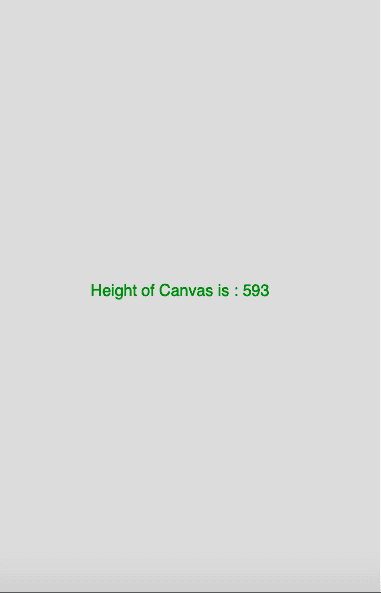

# p5.js |高度变量

> 原文:[https://www.geeksforgeeks.org/p5-js-height-variable/](https://www.geeksforgeeks.org/p5-js-height-variable/)

p5.js 中的**高度变量**是一个存储绘图画布高度的系统变量。它设置 createCanvas()函数的第二个参数。

**语法:**

```
height
```

下面的程序说明了 p5.js 中的高度变量:

**示例 1:** 本示例使用高度变量显示画布的高度。

```
function setup() {

    // Create Canvas of size 380*80  
    createCanvas(380, 80);
}

function draw() {

    // Set the background color
    background(220);

    // Set the text size
    textSize(16);

    // Set the text alignment
    textAlign(CENTER);

    // Set the text color
    fill(color('Green'));

    // Display result
    text("Height of Canvas is : "
        + height, 180, 50);
} 
```

**输出:**


**示例 2:** 本示例使用高度变量来显示窗口的高度。

```
function setup() {
  // set height to window height 
height = windowHeight;
  //create Canvas of size 380*80 
  createCanvas(380, height);
}

function draw() {
  background(220);
  textSize(16);
  textAlign(CENTER);
  fill(color('Green'));
  text("Height of Canvas is : "+height, 180, height/2); //use of height variable
}
```

**输出:**


**参考:**T2】https://p5js.org/reference/#/p5/height