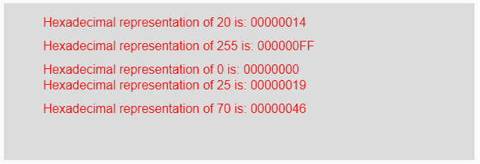
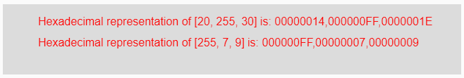

# p5.js | hex()函数

> 原文:[https://www.geeksforgeeks.org/p5-js-hex-function/](https://www.geeksforgeeks.org/p5-js-hex-function/)

p5.js 中的**十六进制()函数**用于*将一个数字转换成它的十六进制表示法。*

**语法:**

```
hex(Number)
```

**参数:**该函数接受一个参数**数**，该参数将被转换为十六进制形式。这个参数也可能是一个数字数组。

**返回值:**返回*转换后的十六进制表示。*

下面的程序说明了
**中的 **hex()** 函数示例-1:**

```
function setup() {

    // Creating Canvas size
    createCanvas(600, 200);
}

function draw() {

    // Set the background color 
    background(220);

    // Initializing some numbers
    let Number1 = 20;
    let Number2 = 255;
    let Number3 = 0;
    let Number4 = 25;
    let Number5 = 70;

    // Calling to hex() function.
    let A = hex(Number1);
    let B = hex(Number2);
    let C = hex(Number3);
    let D = hex(Number4);
    let E = hex(Number5);

    // Set the size of text 
    textSize(16);

    // Set the text color 
    fill(color('red'));

    // Getting hexadecimal notation
    text("Hexadecimal representation of 20 is: " + A, 50, 30);
    text("Hexadecimal representation of 255 is: " + B, 50, 60);
    text("Hexadecimal representation of 0 is: " + C, 50, 90);
    text("Hexadecimal representation of 25 is: " + D, 50, 110);
    text("Hexadecimal representation of 70 is: " + E, 50, 140);
}
```

**输出:**


**示例-2:**

```
function setup() {

    // Creating Canvas size
    createCanvas(650, 100);
}

function draw() {

    // Set the background color 
    background(220);

    // Initializing some numbers
    let Number1 = [20, 255, 30];
    let Number2 = [255, 7, 9];

    // Calling to hex() function.
    let A = hex(Number1);
    let B = hex(Number2);

    // Set the size of text 
    textSize(16);

    // Set the text color 
    fill(color('red'));

    // Getting hexadecimal notation
    text("Hexadecimal representation of [20, 255, 30] is: "
     + A, 50, 30);
    text("Hexadecimal representation of [255, 7, 9] is: " 
     + B, 50, 60);
}
```

**输出:**


**参考:**T2】https://p5js.org/reference/#/p5/hex