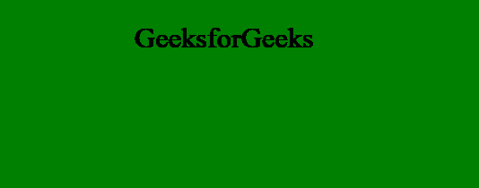
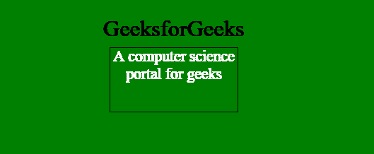

# p5.js | hide()功能

> 原文:[https://www.geeksforgeeks.org/p5-js-hide-function/](https://www.geeksforgeeks.org/p5-js-hide-function/)

**隐藏()功能**是一个内置功能，用于隐藏当前元素。本质上**显示:没有**用于这种风格。
此功能需要 p5.dom 库。所以在**index.html**文件的头部增加下面一行。

## java 描述语言

```
<script language="javascript"
    type="text/javascript" src="path/to/p5.dom.js">
</script>
```

**语法:**

```
hide()
```

**参数:**此功能不接受任何参数。
以下示例说明了 p5.js:
**中的 hide()函数示例 1:** 本示例使用 hide()函数隐藏 div 元素。

## java 描述语言

```
function setup() { 

    // Create Canvas of given size
    var cvs = createCanvas(600, 250);
}

function draw() {

  // Set the background color
  background('green');

  // Use createDiv() function to
  // create a div element
  var myDiv1 = createDiv('GeeksforGeeks');

  // Set the position of div element
  myDiv1.position(170, 30); 

  // Set the div size
  myDiv1.size(200, 100);

  // Set the font-size of text
  myDiv1.style('font-size', '36px');

  // Use createDiv() function to
  // create a div element
  var myDiv = createDiv('A computer science portal for geeks');

  // Set the position of div element
  myDiv.position(180, 80); 

  // Set the div size
  myDiv.size(200, 100);

  // Set the font-size of text
  myDiv.style('font-size', '24px');

  // Set the font-size of text
  myDiv.style('border', '1px solid black');

  // Set the font-size of text
  myDiv.style('text-align', 'center');

  // Set the font color
  myDiv.style('color', 'white');

  // Hide the div element
  myDiv.hide();

}
```

**输出:**



**示例 2:** 本示例使用 hide()和 show()函数显示 div 元素。

## java 描述语言

```
function setup() { 

    // Create Canvas of given size
    var cvs = createCanvas(600, 250);
}

function draw() {

  // Set the background color
  background('green');

  // Use createDiv() function to
  // create a div element
  var myDiv1 = createDiv('GeeksforGeeks');

  // Set the position of div element
  myDiv1.position(170, 30); 

  // Set the div size
  myDiv1.size(200, 100);

  // Set the font-size of text
  myDiv1.style('font-size', '36px');

  // Use createDiv() function to
  // create a div element
  var myDiv = createDiv('A computer science portal for geeks');

  // Set the position of div element
  myDiv.position(180, 80); 

  // Set the div size
  myDiv.size(200, 100);

  // Set the font-size of text
  myDiv.style('font-size', '24px');

  // Set the font-size of text
  myDiv.style('border', '1px solid black');

  // Set the font-size of text
  myDiv.style('text-align', 'center');

  // Set the font color
  myDiv.style('color', 'white');

  // Hide the div element
  myDiv.hide();

  // Show the div element
  myDiv.show();
}
```

**输出:**

