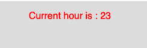

# p5.js | hour()功能

> 原文:[https://www.geeksforgeeks.org/p5-js-hour-function/](https://www.geeksforgeeks.org/p5-js-hour-function/)

p5.js 中的**小时()功能**用于从系统时钟返回当前的小时。它返回一个介于 0 到 23 之间的整数值。

**语法:**

```
hour()
```

**参数:**此功能不接受任何参数。

**返回值:**该函数返回一个代表当前小时的整数值。

下面的程序说明了 p5.js 中的 hour()函数:

**示例:**本示例使用 hour()函数从系统时钟返回当前小时。

```
function setup() {

    // Create Canvas of size 270*80
    createCanvas(270, 80);
}

function draw() {

    // Set the background color
    background(220);

    // Initialize the parameter with
    // current hour
    let h = hour();

    // Set the font size
    textSize(16);

    // Set the font color
    fill(color('red'));

    // Display result
    text("Current hour is : " + h, 50, 30);
}
```

**输出:**

**参考:**[https://p5js.org/reference/#/p5/hour](https://p5js.org/reference/#/p5/hour)