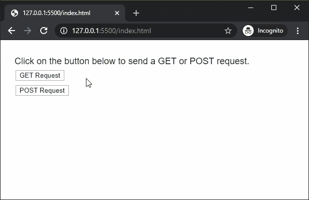
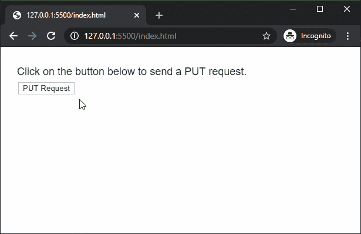

# p5.js | httpDo()功能

> 原文:[https://www.geeksforgeeks.org/p5-js-httpdo-function/](https://www.geeksforgeeks.org/p5-js-httpdo-function/)

p5.js 中的 **httpDo()函数**用于执行一个 HTTP 请求。HTTP 请求的类型可以指定为一个参数，默认情况下是一个 HTTP 请求。p5 会根据 URL 自动猜测返回的数据类型，如果没有指定的话。选项参数可用于根据提取应用编程接口规范指定高级属性。
**语法:**

```
httpDo( path, [method], [datatype], [data], [callback], [errorCallback] )
```

或

```
httpDo( path, options, [callback], [errorCallback] )
```

**参数:**该函数接受 7 个参数，如上所述，描述如下:

*   **路径:**是一个字符串，表示要加载的网址或文件的路径。
*   **方法:**是表示 HTTP 请求方法的字符串。它可以有“获取”、“发布”或“放”的值。默认值为“获取”。这是一个可选参数。
*   **数据类型:**它是一个字符串，指定将要接收的数据类型。它可以有“json”、“jsonp”、“xml”或“text”的值。如果未指定参数，它将默认为“文本”。这是一个可选参数。
*   **数据:**它是一个对象或布尔值，指定随请求传递的参数数据。
*   **回调:**是该函数执行成功时调用的函数。这个函数的第一个参数是从应用编程接口返回的数据。这是一个可选参数。
*   **errorCallback:** 是一个函数，如果执行该函数时出现错误，就会调用该函数。这个函数的第一个参数是错误响应。这是一个可选参数。
*   **选项:**它是一个指定请求选项的对象，如在获取应用编程接口[引用](https://developer.mozilla.org/en/docs/Web/API/Fetch_API)中。

**返回值:**返回一个承诺，当操作成功完成时可以用数据解决，当出现错误时可以拒绝。
以下示例说明了【p5.js:
**中的 **httpDo()功能**示例 1:**

## java 描述语言

```
function setup() {
  createCanvas(550, 300);
  textSize(18);

  text("Click on the button below to send a GET "
           + "or POST request.", 20, 40);

  getBtn = createButton("GET Request");
  getBtn.position(30, 60);
  getBtn.mouseClicked(getRequest);

  postBtn = createButton("POST Request");
  postBtn.position(30, 90);
  postBtn.mouseClicked(postRequest);
}

function getRequest() {
  clear();

  // Get a random user from the test api
  let api_url =
    'https://reqres.in/api/users/' + int(random(1, 10));

  httpDo(api_url, "GET", "json", false, function (response) {

    text("Data fetched from API", 20, 140);

    text("The First Name in the data is: "
                        + response.data.first_name, 20, 180);
    text("The Last Name in the data is: "
                         + response.data.last_name, 20, 200);
    text("The Email in the data is: "
                             + response.data.email, 20, 220);
  });
  text("Click on the button below to send a "
           + "GET or POST request.", 20, 40);
}

function postRequest() {
  clear();

  // Do a POST request to the test API
  let api_url = 'https://reqres.in/api/users';

  // Example POST data
  let postData = { id: 10, name: "Mark", email: "mark@gfg.com" };

  httpDo(api_url, "POST", "json", postData, function (response) {
    text("Data returned from API", 20, 140);

    text("The ID in the data is: " + response.id, 20, 180);
    text("The Name in the data is: " + response.name, 20, 200);
    text("The Email in the data is: " + response.email, 20, 220);
  });
  text("Click on the button below to send a "
           + "GET or POST request.", 20, 40);
}
```

**输出:**



**例 2:**

## java 描述语言

```
function setup() {
  createCanvas(550, 300);
  textSize(18);

  text("Click on the button below to send a PUT request.", 20, 40);

  getBtn = createButton("PUT Request");
  getBtn.position(30, 60);
  getBtn.mouseClicked(putRequest);
}

function putRequest() {

  let putData = { name: "Dan", email: "dan@gfg.com" };

  // Get a random user from the test api
  let api_url =
    'https://reqres.in/api/users/' + int(random(1, 10));

  httpDo(api_url, "PUT", "json", putData, function (response) {
    text("Data returned from API", 20, 140);

    text("The updated name is: " + response.name, 20, 180);
    text("The updated email is: " + response.email, 20, 200);
    text("Data is updated at: " + response.updatedAt, 20, 220);
  });
}
```

**输出:**



**在线编辑:**[【https://editor.p5js.org/】](https://editor.p5js.org/)
**环境设置:**[https://www . geeksforgeeks . org/P5-js-soundfile-object-installation-and-methods/](https://www.geeksforgeeks.org/p5-js-soundfile-object-installation-and-methods/)
**参考:**[https://p5js.org/reference/#/p5/httpDo](https://p5js.org/reference/#/p5/httpDo)