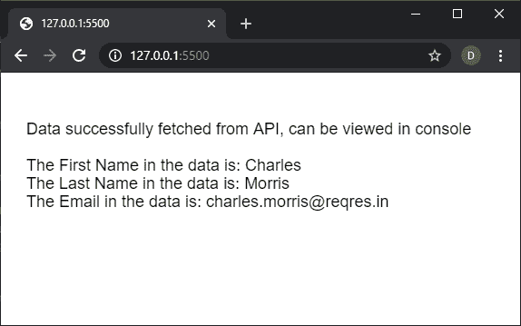

# p5.js | httpGet()功能

> 原文:[https://www.geeksforgeeks.org/p5-js-httpget-function/](https://www.geeksforgeeks.org/p5-js-httpget-function/)

p5.js 中的 **httpGet()函数**用于执行一个 httpGet 请求。p5 会根据 URL 自动猜测返回的数据类型，如果没有指定的话。
数据可以加载到 preload()函数中，以便可以在程序中立即访问。
**语法:**

```
httpGet( path, [datatype], [data], [callback], [errorCallback] )
```

或

```
httpGet( path, data, [callback], [errorCallback] )
```

或

```
httpGet( path, callback, [errorCallback] )
```

**参数:**该功能接受五个参数，如上所述，如下所述。

*   **路径:**是一个字符串，表示要加载的网址或文件的路径。
*   **数据类型:**它是一个字符串，指定将要接收的数据类型。它可以有“json”、“jsonp”、“binary”、“arrayBuffer”、“xml”或“text”的值。使用“二进制”数据类型将返回一个 Blob 对象，使用“arrayBuffer”将返回一个类型化数组。如果未指定参数，它将默认为“文本”。这是一个可选参数。
*   **数据:**它是一个对象或布尔值，指定随请求传递的参数数据。
*   **回调:**是该函数执行成功时调用的函数。这个函数的第一个参数是从应用编程接口返回的数据。这是一个可选参数。
*   **errorCallback:** 是一个函数，如果执行该函数时出现错误，就会调用该函数。这个函数的第一个参数是错误响应。这是一个可选参数。

**返回值:**返回一个承诺，当操作成功完成时可以用数据解决，当出现错误时可以拒绝。
以下示例说明了【p5.js:
**示例 1:**
中的 **httpGet()函数**

## java 描述语言

```
let user_data;

function preload() {

  // Get a random user from the test API
  let api_url =
    'https://reqres.in/api/users/' + int(random(1, 10));

  httpGet(api_url, 'json', false, function (response) {
    user_data = response;
  });

  // Log the received data to console
  console.log(user_data);
}

function setup() {
  createCanvas(550, 200);
  textSize(18);
}

function draw() {
  clear();
  if (!user_data)
    return;

  text("Data fetched from API, can be viewed "
        + "in console", 20, 60);

  text("The First Name in the data is: "
       + user_data.data.first_name, 20, 100);

  text("The Last Name in the data is: "
       + user_data.data.last_name, 20, 120);

  text("The Email in the data is: "
       + user_data.data.email, 20, 140);
}
```

**输出:**


**例 2:**

## java 描述语言

```
function setup() {
  createCanvas(550, 200);
  textSize(18);

  // Get a random user from the test API
  let api_url =
    'https://reqres.in/api/users/' + int(random(1, 10));

  httpGet(api_url, 'json', false, onSuccessfulFetch, onErrorFetch);
}

function onSuccessfulFetch(response) {
  text("Data successfully fetched from API, "
      + "can be viewed in console", 20, 60);

  text("The First Name in the data is: "
      + response.data.first_name, 20, 100);

  text("The Last Name in the data is: "
      + response.data.last_name, 20, 120);

  text("The Email in the data is: "
      + response.data.email, 20, 140);
}

function onErrorFetch() {
  text("There was an error fetching the data.", 20, 60);
}
```

**输出:**



**在线编辑:**[【https://editor.p5js.org/】](https://editor.p5js.org/)
**环境设置:**[https://www . geeksforgeeks . org/P5-js-soundfile-object-installation-and-methods/](https://www.geeksforgeeks.org/p5-js-soundfile-object-installation-and-methods/)
**参考:**[https://p5js.org/reference/#/p5/httpGet](https://p5js.org/reference/#/p5/httpGet)