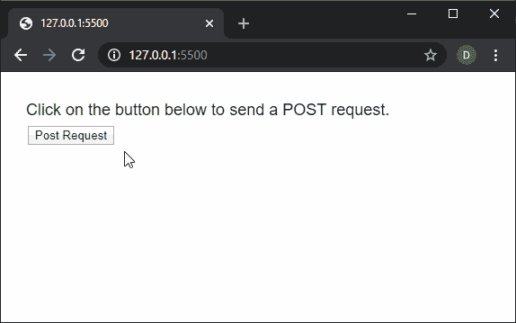

# P5 . js | httpset()功能

> 原文:[https://www.geeksforgeeks.org/p5-js-httppost-function/](https://www.geeksforgeeks.org/p5-js-httppost-function/)

p5.js 中的**httpset()函数**用于执行一个 httpPost 请求。p5 会根据 URL 自动猜测返回的数据类型，如果没有指定的话。

返回的数据可以加载到**预加载()函数**中，以便可以在程序中立即访问。

**语法:**

```
httpPost( path, [datatype], [data], [callback], [errorCallback] )
```

运筹学

```
httpPost( path, data, [callback], [errorCallback] )
```

运筹学

```
httpPost( path, callback, [errorCallback] )
```

**参数:**该函数接受五个参数，如上所述，如下所述:

*   **路径:**是一个字符串，表示要加载的网址或文件的路径。
*   **数据类型:**它是一个字符串，指定将接收的数据类型。它可以有“json”、“jsonp”、“xml”或“text”的值。如果未指定参数，它将默认为“文本”。这是一个可选参数。
*   **数据:**它是一个对象或布尔值，指定随请求传递的参数数据。
*   **回调:**是该函数执行成功时调用的函数。这个函数的第一个参数是从应用编程接口返回的数据。这是一个可选参数。
*   **errorCallback:** 是一个函数，如果执行该函数时出现错误，就会调用该函数。这个函数的第一个参数是错误响应。这是一个可选参数。

**返回值:**返回一个承诺，当操作成功完成时可以用数据解决，当出现错误时可以拒绝。

下面的例子说明了 p5.js 中的**httpset()函数**:

**例 1:**

```
function setup() {
  createCanvas(550, 200);
  textSize(18);

  text("Click on the button below"+
       " to send a POST request.", 20, 40);

  postBtn = createButton("Post Request");
  postBtn.position(30, 60);
  postBtn.mouseClicked(postRequest);
}

function postRequest() {

  // Do a POST request to the test API
  let api_url = 'https://reqres.in/api/users';

  // Example POST data
  let postData = { id: 1, name: "Sam",
                  email: "sam@samcorp.com" };

  httpPost(api_url, 'json', postData, function (response) {
    text("Data returned from API", 20, 100);

    text("The ID in the data is: "
         + response.id, 20, 140);
    text("The Name in the data is: " 
         + response.name, 20, 160);
    text("The Email in the data is: " 
         + response.email, 20, 180);
  });
}
```

**输出:**


**例 2:**

```
function setup() {
  createCanvas(550, 200);
  textSize(18);

  // Do a POST request to the test API
  let api_url = 
      'https://reqres.in/api/users';

  let postData = { id: 1, name: "James", 
                  email: "james@james.j.com" };

  httpPost(api_url, 'json', postData, 
           onSuccessfulFetch, onErrorFetch);
}

function onSuccessfulFetch(response) {
  text("Data returned from API", 20, 60);

  text("The ID in the data is: " 
       + response.id, 20, 100);
  text("The Name in the data is: "
       + response.name, 20, 120);
  text("The Email in the data is: " 
       + response.email, 20, 140);
}

function onErrorFetch() {
  text("There was an error doing"+
       " the request.", 20, 60);
}
```

**输出:**


**在线编辑:**[https://editor.p5js.org/](https://editor.p5js.org/)

**环境设置:**

**参考:**T2】https://p5js.org/reference/#/p5/httpPost