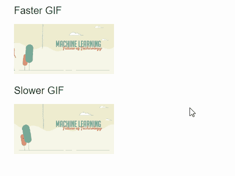
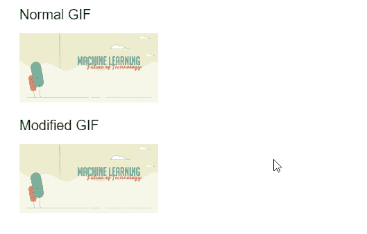

# p5.js 图像延迟()方法

> 原文:[https://www.geeksforgeeks.org/p5-js-image-delay-method/](https://www.geeksforgeeks.org/p5-js-image-delay-method/)

p5 的**延迟()方法**。p5.js 中的 Image 用于更改 GIF 动画中每帧之间的延迟。该值可以以毫秒为单位设置，较高的值意味着 GIF 将在较长时间后显示其下一帧。

可选的第二个参数可用于指定需要设置新延迟值的帧的索引。如果没有指定任何内容，所有帧都将获得新的延迟值。

**语法:**

```
resize( d, index )

```

**参数:**该函数接受两个参数，如上所述，如下所述。

*   **d:** 它是一个数字，以毫秒为单位指定每帧之间的延迟量。
*   **索引:**它是一个数字，指定必须修改的帧的索引。这是一个可选参数。

下面的例子说明了 p5.js 中的**延迟()方法**:

**例 1:**

## java 描述语言

```
function preload() {
    faster_gif = loadImage("sample-gif.gif");
    slower_gif = loadImage("sample-gif.gif");
}

function setup() {
    createCanvas(500, 300);
    textSize(20);

    text('Faster GIF', 20, 20);
    text('Slower GIF', 20, 180);

    // Speed up the GIF with a delay
    // of 10 milliseconds between
    // each frame
    faster_gif.delay(10);

    // Slow down the GIF with a delay
    // of 100 milliseconds between
    // each frame
    slower_gif.delay(100);
}

function draw() {
    image(faster_gif, 20, 40, 200, 100);
    image(slower_gif, 20, 200, 200, 100);
}
```

**输出:**



**例 2:**

## java 描述语言

```
function preload() {
    normal_gif = loadImage("sample-gif.gif");
    modified_gif = loadImage("sample-gif.gif");
}

function setup() {
    createCanvas(500, 300);
    textSize(20);

    text('Normal GIF', 20, 20);
    text('Modified GIF', 20, 180);

    // Modify the GIF with the delay
    // applied to the 100th frame
    modified_gif.delay(4000, 100);
}

function draw() {
    image(normal_gif, 20, 40, 200, 100);
    image(modified_gif, 20, 200, 200, 100);
}
```

**输出:**



**在线编辑:**[【https://editor.p5js.org/】](https://editor.p5js.org/)
**环境设置:**[https://www . geeksforgeeks . org/P5-js-soundfile-object-installation-and-methods/](https://www.geeksforgeeks.org/p5-js-soundfile-object-installation-and-methods/)
**参考:**[https://p5js.org/reference/#/p5.Image/delay](https://p5js.org/reference/#/p5.Image/delay)