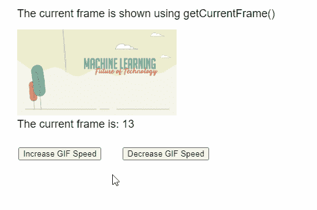
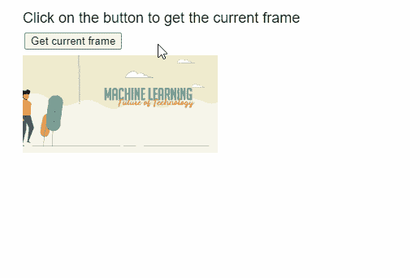

# p5.js Image getCurrentFrame()方法

> 原文:[https://www . geesforgeks . org/P5-js-image-getcurrentframe-method/](https://www.geeksforgeeks.org/p5-js-image-getcurrentframe-method/)

p5 的 **getCurrentFrame()** 方法。 **p5.js** 库中的图像用于返回当前显示的 GIF 动画帧的索引。

**语法:**

```
  getCurrentFrame()
```

**参数:**该函数接受不接受任何参数。

**返回值:**这个方法返回一个数字，代表当前可见的动画的当前帧。

实现以下示例时，以下库包含在 HTML 页面的“标题”部分。

> <脚本 src = " P5 . min . js "></脚本>

**示例 1:** 下面的示例说明了 **p5.js** 库中的 **getCurrentFrame()** 方法。

## java 描述语言

```
function setup() {
  example_gif =
    loadImage("sample-gif.gif");

  createCanvas(500, 300);
  textSize(18);

  incSpeedBtn =
    createButton("Increase GIF Speed");
  incSpeedBtn.position(30, 240);
  incSpeedBtn.mousePressed(() => {

      // Decrease the delay between frames
      example_gif.delay(25);
  })

  decSpeedBtn =
    createButton("Decrease GIF Speed");
  decSpeedBtn.position(200, 240);
  decSpeedBtn.mousePressed(() =>
 {
      // Increase the delay between frames
      example_gif.delay(150);
  })
}

function draw()
{
  clear();

  text("The current frame is shown " +
       "using getCurrentFrame()", 20, 20);

  // Draw the GIF on screen
  image(example_gif, 20, 40, 260, 140);

  // Get the current frame
  let currFrame =
      example_gif.getCurrentFrame();

  text("The current frame is: " +
       currFrame, 20, 200);
}
```

**输出:**



**例 2:**

## java 描述语言

```
function preload() {
  example_gif =
    loadImage("sample-gif.gif");
}

function setup() {
  createCanvas(500, 300);
  textSize(18);

  text("Click on the button to get " +
       "the current frame", 20, 20);

  frameBtn =
    createButton("Get current frame");
  frameBtn.position(30, 40);
  frameBtn.mousePressed(getFrame);
}

function draw() {
  // Draw the GIF on screen
  image(example_gif, 20, 60, 240, 120);
}

function getFrame()
{
  clear();

  // Get the current frame
  let currFrame =
      example_gif.getCurrentFrame();

  text("The current frame is: " +
       currFrame, 20, 200);

  text("Click on the button to get " +
       "the current frame", 20, 20);
}
```

**输出:**



**在线编辑:**[【https://editor.p5js.org/】](https://editor.p5js.org/)
**环境设置:**[https://www . geeksforgeeks . org/P5-js-soundfile-object-installation-and-methods/](https://www.geeksforgeeks.org/p5-js-soundfile-object-installation-and-methods/)
**参考:**[https://p5js.org/reference/#/p5.Image/getCurrentFrame](https://p5js.org/reference/#/p5.Image/getCurrentFrame)