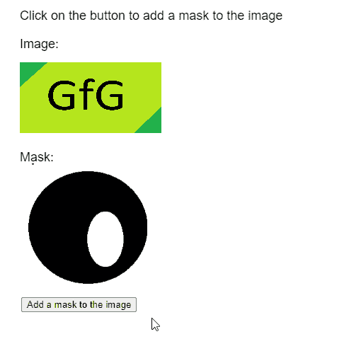

# p5.js 图像蒙版()方法

> 原文:[https://www.geeksforgeeks.org/p5-js-image-mask-method/](https://www.geeksforgeeks.org/p5-js-image-mask-method/)

p5 的**掩()**法。 **p5.js** 库中的图像用于对图像应用给定的蒙版。这是通过使用遮罩图像的 alpha 通道作为该图像的 alpha 通道来完成的。

**语法:**

```
mask( srcImage )

```

**参数:**该函数接受一个参数，如上所述，如下所述。

*   **srcImage:** 是 p5。将用作要应用的蒙版的图像。

实现以下示例时，以下库包含在 HTML 页面的“标题”部分。

> <脚本 src = " P5 . min . js "></脚本>

**示例:**下面的示例说明了 **p5.js** 库中的 **mask()** 方法。

## java 描述语言

```
function preload() {
    img_orig =
      loadImage("sample-image.png");
    img_mask =
      loadImage("image-mask.png");
}

function setup() {
    createCanvas(500, 500);
    textSize(20);

    btnBlur =
      createButton("Add a mask to the image");
    btnBlur.position(30, 420);
    btnBlur.mousePressed(applyMask);
}

function draw() {
    clear();

    text("Click on the button to add " +
         "a mask to the image", 20, 20);
    text('Image:', 20, 60);
    image(img_orig, 20, 80, 200, 100);

    text("Mask:", 20, 220);
    image(img_mask, 20, 220, 180, 180);
}

function applyMask()
{
    // Apply the given mask to the image
    img_orig.mask(img_mask);
}
```

**输出:**



**在线编辑:**[【https://editor.p5js.org/】](https://editor.p5js.org/)
**环境设置:**[https://www . geeksforgeeks . org/P5-js-soundfile-object-installation-and-methods/](https://www.geeksforgeeks.org/p5-js-soundfile-object-installation-and-methods/)
**参考:**[https://p5js.org/reference/#/p5.Image/mask](https://p5js.org/reference/#/p5.Image/mask)