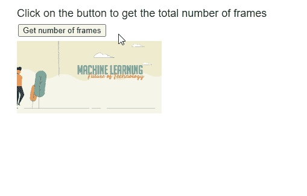

# p5.js Image numFrames()方法

> 原文:[https://www.geeksforgeeks.org/p5-js-image-numframes-method/](https://www.geeksforgeeks.org/p5-js-image-numframes-method/)

p5 的 **numFrames()** 方法。 **p5.js** 库中的图像用于返回 GIF 动画的总帧数。

**语法:**

```
 numFrames()

```

**参数:**该函数接受不接受任何参数。

**返回值:**这个方法返回一个数字，代表 GIF 动画的总帧数。

实现以下示例时，以下库包含在 HTML 页面的“标题”部分。

> <脚本 src = " P5 . min . js "></脚本>

**示例:**下面的示例说明了 **p5.js** 中的**numrames()**方法

## java 描述语言

```
function preload() {
    example_gif =
      loadImage("sample-gif.gif");
}

function setup() {
    createCanvas(500, 300);
    textSize(18);

    text("Click on the button to get " +
         "the total number of frames",
         20, 20);

    frameBtn =
      createButton("Get number of frames");
    frameBtn.position(30, 40);
    frameBtn.mousePressed(getTotalFrames);
}

function draw() {

  // Draw the GIF on screen
  image(example_gif, 20, 60, 240, 120);
}

function getTotalFrames()
{
  // Get the total number of frames
  let numberOfFrames =
      example_gif.numFrames();

  text("Number of frames in the GIF is: "
       + numberOfFrames, 20, 200);
}
```

**输出:**



**在线编辑:**[【https://editor.p5js.org/】](https://editor.p5js.org/)
**环境设置:**[https://www . geeksforgeeks . org/P5-js-soundfile-object-installation-and-methods/](https://www.geeksforgeeks.org/p5-js-soundfile-object-installation-and-methods/)
**参考:**[https://p5js.org/reference/#/p5.Image/numFrames](https://p5js.org/reference/#/p5.Image/numFrames)