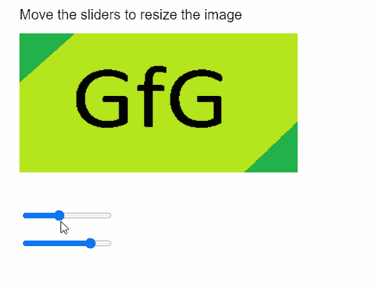
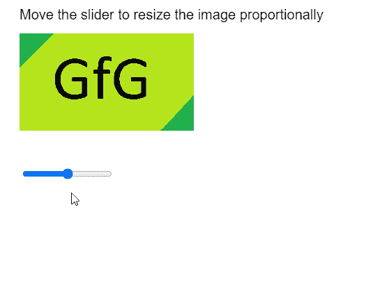

# p5.js 图像调整大小()方法

> 原文:[https://www.geeksforgeeks.org/p5-js-image-resize-method/](https://www.geeksforgeeks.org/p5-js-image-resize-method/)

p5 的**调整大小()方法**。p5.js 中的 Image 用于将图像调整到给定的宽度和高度。通过使用 0 作为宽度和高度值之一，可以按比例缩放图像。

**语法:**

```
resize( width, height )

```

**参数:**该函数接受两个参数，如上所述，如下所述。

*   **宽度:**是一个数字，指定调整大小后的图像的宽度。
*   **高度:**是一个数字，指定调整大小后图像的高度。

下面的例子说明了 p5.js 中的 **resize()方法**:

**例 1:**

## java 描述语言

```
function preload() {
    img_orig = loadImage("sample-image.png");
}

function setup() {
    createCanvas(500, 400);
    textSize(20);

    heightSlider =
      createSlider(0, 500, 200);
    heightSlider.position(30, 300);

    widthSlider =
      createSlider(0, 500, 400);
    widthSlider.position(30, 340);
}

function draw() {
    clear();

    text("Move the sliders to resize the image",
      20, 20);
    image(img_orig, 20, 40);

    new_height = heightSlider.value();
    new_width = widthSlider.value();

    img_orig.resize(new_width, new_height);
}
```

**输出:**



**例 2:**

## java 描述语言

```
function preload() {
    img_orig = loadImage("sample-image.png");
}

function setup() {
    createCanvas(500, 400);
    textSize(20);

    sizeSlider =
      createSlider(0, 500, 250);
    sizeSlider.position(30, 240);
}

function draw() {
    clear();

    text("Move the slider to resize " +
      "the image proportionally", 20, 20);
    image(img_orig, 20, 40);

    new_size = sizeSlider.value();

    // Setting one of the values as 0,
    // for proportional resizing
    img_orig.resize(new_size, 0);
}
```

**输出:**



**在线编辑:**[【https://editor.p5js.org/】](https://editor.p5js.org/)
**环境设置:**[https://www . geeksforgeeks . org/P5-js-soundfile-object-installation-and-methods/](https://www.geeksforgeeks.org/p5-js-soundfile-object-installation-and-methods/)
**参考:**[https://p5js.org/reference/#/p5.Image/resize](https://p5js.org/reference/#/p5.Image/resize)