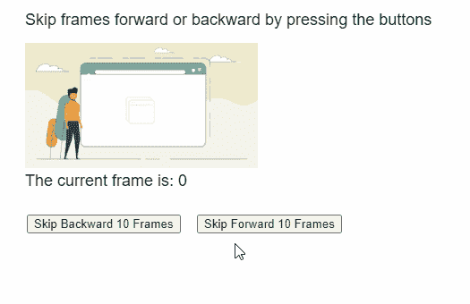
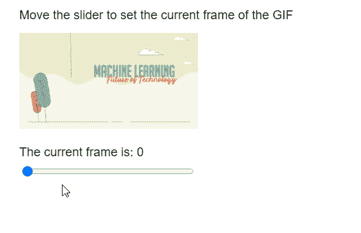

# p5.js Image setFrame()方法

> 原文:[https://www.geeksforgeeks.org/p5-js-image-setframe-method/](https://www.geeksforgeeks.org/p5-js-image-setframe-method/)

p5 的**设置框架()**方法。 **p5.js** 库中的图像用于设置 GIF 动画当前可见帧的索引。

**语法:**

```
setFrame( index )

```

**参数:**该函数接受一个参数，如上所述，如下所述。

*   **索引:**是表示要显示的帧的索引的数字。

实现以下示例时，以下库包含在 HTML 页面的“标题”部分。

> <脚本 src = " P5 . min . js "></脚本>

**示例 1:** 以下示例说明了 **p5.js** 库中的 **setFrame()** 方法。

## java 描述语言

```
function preload() {
  example_gif =
    loadImage("sample-gif.gif");
}

function setup() {
  createCanvas(500, 300);
  textSize(18);

  example_gif.pause();

  decFrameBtn =
    createButton("Skip Backward 10 Frames");
  decFrameBtn.position(30, 240);
  decFrameBtn.mousePressed(skipBackward);

  incFrameBtn =
    createButton("Skip Forward 10 Frames");
  incFrameBtn.position(220, 240);
  incFrameBtn.mousePressed(skipForward);
}

function draw() {
  clear();

  text("Skip frames forward or backward " +
       "by pressing the buttons", 20, 20);

  // Draw the GIF on screen
  image(example_gif, 20, 40, 260, 140);

  // Get the current frame
  let currFrame =
      example_gif.getCurrentFrame();

  text("The current frame is: " +
       currFrame, 20, 200);
}

function skipForward() {

  // Get the current playing frame of the GIF
  let currFrame =
      example_gif.getCurrentFrame();

  // Move forward only if possible
  if (currFrame <
      example_gif.numFrames() - 10) {

    // Add 10 to skip forward
    let newFrame = currFrame + 10;

    example_gif.setFrame(newFrame);
  }
}

function skipBackward() {

  // Get the current playing frame of the GIF
  let currFrame =
      example_gif.getCurrentFrame();

  // Move forward only if possible
  if (currFrame > 10) {

    // Subtract 10 to skip forward
    let newFrame = currFrame - 10;

    example_gif.setFrame(newFrame);
  }
}
```

**输出:**



**例 2:**

## java 描述语言

```
function preload() {
  example_gif =
    loadImage("sample-gif.gif");
}

function setup() {
  createCanvas(500, 300);
  textSize(18);

  example_gif.pause();

  let totalFrames =
      example_gif.numFrames() - 1;

  frameSlider = 
    createSlider(0, totalFrames, 0, 1);
  frameSlider.position(30, 240);
  frameSlider.size(250);
}

function draw() {
  clear();

  text("Move the slider to set the " +
       "current frame of the GIF", 20, 20);

  // Draw the GIF on screen
  image(example_gif, 20, 40, 260, 140);

  // Set the current frame according to the
  // value of the slider
  example_gif.setFrame(frameSlider.value());

  // Get the current frame
  let currFrame =
      example_gif.getCurrentFrame();

  text("The current frame is: " +
       currFrame, 20, 220);
}
```

**输出:**



**在线编辑:**[【https://editor.p5js.org/】](https://editor.p5js.org/)
**环境设置:**[https://www . geeksforgeeks . org/P5-js-soundfile-object-installation-and-methods/](https://www.geeksforgeeks.org/p5-js-soundfile-object-installation-and-methods/)
**参考:**[https://p5js.org/reference/#/p5.Image/setFrame](https://p5js.org/reference/#/p5.Image/setFrame)