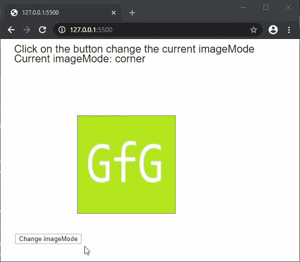

# p5.js | imageMode()功能

> 原文:[https://www.geeksforgeeks.org/p5-js-imagemode-function/](https://www.geeksforgeeks.org/p5-js-imagemode-function/)

**图像模式()**功能用于设置图像的图像模式。图像模式通过改变对**图像()**功能给出的参数的解释方式来定义图像在画布中的位置。

**语法:**

```
imageMode( mode )
```

**参数:**该功能接受单个参数**模式**，定义要使用的模式。它可以具有以下值:

*   **CORNER:** 该模式将图像()的第二个和第三个参数解释为图像的左上角。
*   **CORNERS:** 该模式将赋予图像()的第二个和第三个参数解释为图像的左上角，第四个和第五个参数解释为图像的右下角。
*   **中心:**该模式将赋予图像()的第二个和第三个参数解释为图像的中心点。此外，如果指定了第四个和第五个参数，它们将用作图像的宽度和高度。

下面的例子说明了 p5.js 中的 **imageMode()函数**:

**示例:**

```
function preload() {
  img = loadImage('sample-image.png');
}

function setup() {
  imageModes = [
    CORNER,
    CORNERS,
    CENTER
  ];
  i = 0;
  currMode = imageModes[i];

  createCanvas(600, 400);
  textSize(22);

  // Create a button for the switching
  // the imageMode
  switchBtn = createButton("Change imageMode");
  switchBtn.position(30, 400)
  switchBtn.mousePressed(switchMode);
}

function draw() {
  clear();
  text("Click on the button change the current"+
                           " imageMode", 20, 20);
  text("Current imageMode: " + currMode, 20, 40);

  // Creating a rectangle to demonstrate
  // the location of the image
  rect(150, 150, 200, 200);

  // Setting the imageMode
  imageMode(currMode);

  // Drawing the image
  image(img, 150, 150, 200, 200);
}

function switchMode() {
  // Change the current imageMode
  if (i < imageModes.length - 1)
    i++;
  else
    i = 0;
  currMode = imageModes[i];
}
```

**输出:**


**在线编辑:**[https://editor.p5js.org/](https://editor.p5js.org/)

**环境设置:**

**参考:**T2】https://p5js.org/reference/#/p5/imagemode