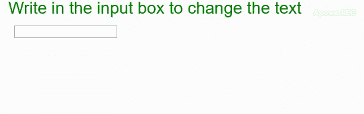

# p5.js | input()函数

> 原文:[https://www.geeksforgeeks.org/p5-js-input-function/](https://www.geeksforgeeks.org/p5-js-input-function/)

只要在元素上检测到用户输入，就会调用**输入()**功能。它可以用来检测击键或滑块值的变化。它还可以用于将事件侦听器附加到元素。

**语法:**

```
input(fxn)
```

**参数:**该函数接受一个参数，如上所述，如下所述。

*   **fxn:** 这是每当检测到输入时都会调用的回调函数。它可以被传递为“假”，这将阻止先前的触发功能停止触发。

下面的例子说明了 p5.js 中的**输入()功能**:

**示例:**

```
function setup() {
  createCanvas(600, 300);
  textSize(28);
  fill("green")
  text("Write in the input box to change the text", 10, 20);

  // create input box
  let inputElem = createInput('');
  inputElem.input(onInput);
  inputElem.position(20, 40)
}

function onInput() {
  clear();
  text("Write in the input box to change the text", 10, 20);

  fill("green")
  strokeWeight(10)
  rect(0, 80, 600, 100)

  // get the text entered
  fill("black")
  text(this.value(), 20, 120)
}
```

**输出:**


**在线编辑:**[【https://editor.p5js.org/】](https://editor.p5js.org/)
**环境设置:**[https://www . geeksforgeeks . org/P5-js-soundfile-object-installation-and-methods/](https://www.geeksforgeeks.org/p5-js-soundfile-object-installation-and-methods/)

**参考:**T2】https://p5js.org/reference/#/p5/input