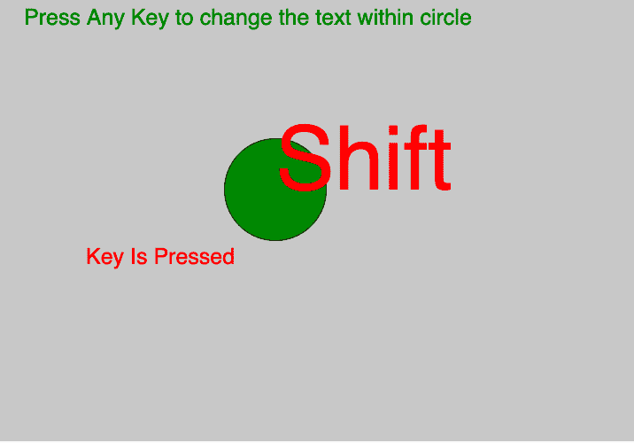
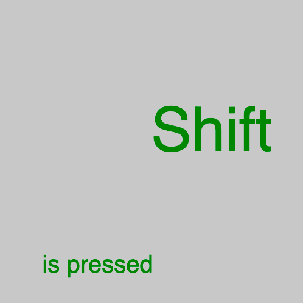

# p5.js |键盘|按键

> 原文:[https://www.geeksforgeeks.org/p5-js-keyboard-key/](https://www.geeksforgeeks.org/p5-js-keyboard-key/)

p5.js *中的**键**变量始终包含最近按下的*键的值。为了获得适当的资本化，最好在**键盘输入()**中使用。对于非 ASCII 键，使用键码变量。

**语法:**

```
key

```

下面的程序举例说明了 p5.js 中的关键变量:
**例-1:**

```
let valueX;
let valueY;

function setup() {

    // Create Canvas of size 500*500
    createCanvas(1000, 500);
}

function draw() {

    // set background color
    background(200);

    fill('green');
    // set text and text size
    textSize(25);
    text(
      'Press Any Key to change the text within circle'
      , 30, 30);

    // use of keyIsPressed Variable
    if (keyIsPressed) {
        // draw ellipse  
        ellipse(mouseX, mouseY, 115, 115);
        fill('red');
        text("Key Is Pressed", 100, 300);
        textSize(100);
        text(key, mouseX, mouseY);
    } 

    else {
        rect(mouseX / 2, mouseY / 2, 300, 200);
        text(key, mouseX, mouseY);
    }

}
```

**输出:**


**示例-2:**

```
let valueX;
let valueY;

function setup() {

    // Create Canvas of size 500*500
    createCanvas(500, 500);
}

function draw() {

    // set background color
    background(200);

    fill('green');

    // set text and text size
    textSize(100);

    text(key, height / 2, width / 2);
    if (keyIsPressed) {
        textSize(40);
        text("is pressed", height / 7, width - 50);
    }

}
```

**输出:**


**参考:**T2】https://p5js.org/reference/#/p5/key