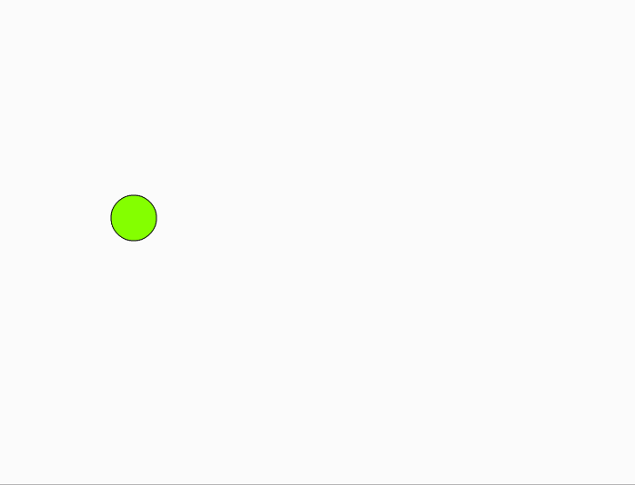
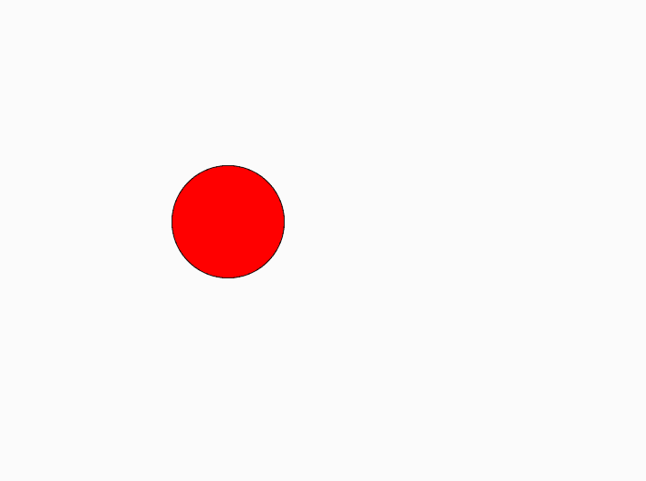

# P5 . js | Keyboard | keyidsdown()

> 原文:[https://www.geeksforgeeks.org/p5-js-keyboard-keyisdown/](https://www.geeksforgeeks.org/p5-js-keyboard-keyisdown/)

p5.js 中的 **keyIsDown()** 功能检查按键的当前状态，即按键按下。如果您有一个可移动的对象，并且您希望几个键能够同时影响其行为，例如对角移动精灵，则可以使用它。

**语法:**

```
keyIsDown()

```

下面的程序说明了 p5.js:
**中的 **keyIsDown()** 功能示例-1:**

```
let x = 100;
let y = 100;

function setup() {

    // create canvas of size 600*600
    createCanvas(600, 600);
}

function draw() {

    // fill color
    fill(x, y, x - y);

    if (keyIsDown(LEFT_ARROW)) {
        x -= 5;
    }

    if (keyIsDown(RIGHT_ARROW)) {
        x += 5;
    }

    if (keyIsDown(UP_ARROW)) {
        y -= 5;
    }

    if (keyIsDown(DOWN_ARROW)) {
        y += 5;
    }

    clear();
    ellipse(x, y, 50, 50);
}
```

**输出:**


**示例-2:**

```
let diameter = 30;

function setup() {

    // Create canvas of size 600*600
    createCanvas(600, 600);
}

function draw() {

    // 107 and 187 are keyCodes for "+"
    if (keyIsDown(107) || keyIsDown(187)) {
        diameter += 1;
    }

    // 109 and 189 are keyCodes for "-"
    if (keyIsDown(109) || keyIsDown(189)) {
        diameter -= 1;
    }

    clear();
    fill(255, 0, 0);
    ellipse(width / 2, height / 2, diameter, diameter);
}
```

**输出:**

**参考:**[https://p5js.org/reference/#/p5/keyIsDown](https://p5js.org/reference/#/p5/keyIsDown)