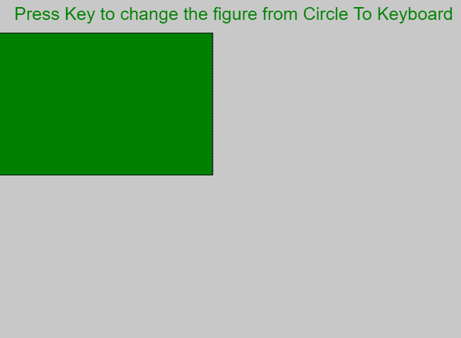
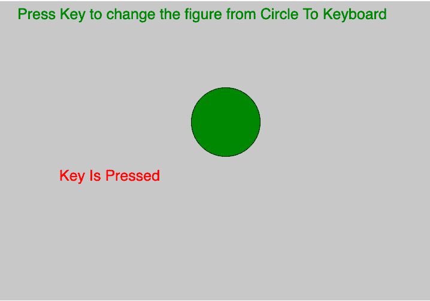
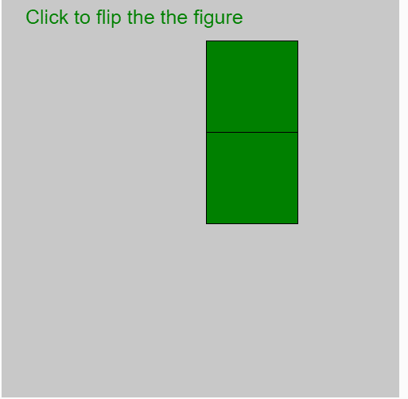
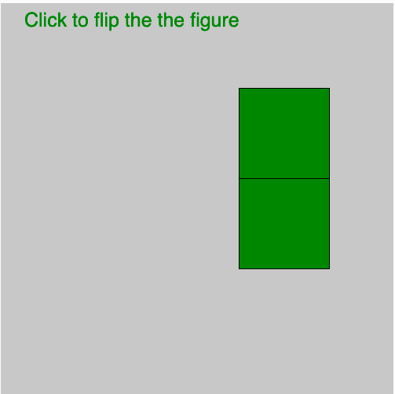

# p5.js 键盘| keyispresent

> 原文:[https://www.geeksforgeeks.org/p5-js-keyboard-keyispressed/](https://www.geeksforgeeks.org/p5-js-keyboard-keyispressed/)

p5.js 中的 **keyIsPressed** 变量为 **true** *如果按下任何键，则为 false 如果没有按下任何键*。

**语法:**

```
keyIsPressed

```

下面的程序举例说明了 p5.js 中的 keyIsPressed 变量:
**示例-1:**

```
let valueX;
let valueY;

function setup() {
    // Create Canvas of size 500*500
    createCanvas(1000, 500);
}

function draw() {

    // set background color
    background(200);
    fill('green');

    // set text and text size
    textSize(25);

    text('Press Key to change the figure '+
         'from Circle To Keyboard', 30, 30);

    // use of keyIsPressed Variable
    if (keyIsPressed) {
        // draw ellipse  
        ellipse(mouseX, mouseY, 115, 115);
        fill('red');
        text("Key Is Pressed", 100, 300);
    } else {
        rect(mouseX / 2, mouseY / 2, 300, 200);
    }

}
```

**输出:**
**前:**

**后:**


**示例-2:**

```
let valueX;
let valueY;

function setup() {

    // Create Canvas of size 500*500
    createCanvas(500, 500);
}

function draw() {

    // set background color
    background(200);

    fill('green');

    // set text and text size
    textSize(25);
    text('Click to flip the the figure', 30, 30);

    // use of KeyIsPressed
    if (keyIsPressed) {
        fill(valueX, 255 - valueY, 255 - valueX);

        // draw rectangle 
        rect(mouseX, mouseY, 115, 115);
        fill(valueY, 255 - valueX, 255 - valueX);

        rect(mouseX, mouseY + 115, 115, 115);
        fill(255 - valueY, 255 - valueX, 255 - valueY);
    } else {
        rect(mouseX - 115, mouseY, 115, 115);
        fill(255 - valueY, 255 - valueY, 255 - valueY);

        rect(mouseX - 115, mouseY + 115, 115, 115);
    }
}
```

**输出:**
**前:**

**后:**

**参考:**[https://p5js.org/reference/#/p5/keyIsPressed](https://p5js.org/reference/#/p5/keyIsPressed)