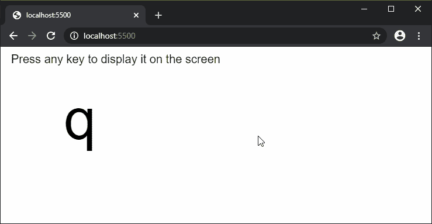
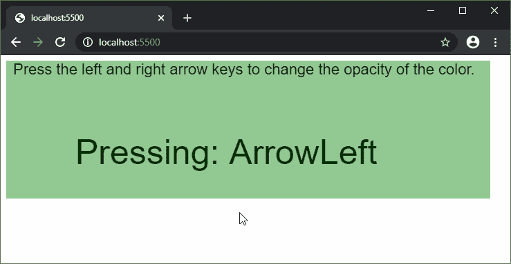

# P5 . js | keypress()函数

> 原文:[https://www.geeksforgeeks.org/p5-js-keypressed-function/](https://www.geeksforgeeks.org/p5-js-keypressed-function/)

每当按下一个键时，就会调用**Keypress()功能**。最近键入的 ASCII 键存储在“键”变量中，但是它不区分大写和小写字符。非 ASCII 字符代码可以用它们各自的名称在“键码”变量中访问。

按住一个键可能会导致多次 keyPressed()调用。这是因为操作系统如何处理按键，并且取决于计算机的配置。浏览器可能有自己的默认行为附加到各种键上。这可以通过在方法的末尾添加“return false”来防止。

**语法:**

```
keyPressed()
```

**参数:**此方法不接受任何参数。

下面的例子说明了 p5.js 中的**Keypress()函数**:

**例 1:**

```
function setup() {
  createCanvas(600, 200);
  textSize(20);
  text("Press any key to display it "
          + "on the screen", 10, 20);
}

function keyPressed() {
  clear();
  textSize(20);
  text("Press any key to display it "
          + "on the screen", 10, 20);
  textSize(100);
  text(key, 100, 150);
}
```

**输出:**


**例 2:**

```
let opac = 128;

function setup() {
  createCanvas(700, 200);
  background(0, 128, 0, opac);
  textSize(22);
  text("Press the left and right arrow"
        + " keys to change the opacity"
        + " of the color.", 10, 20);
}

function keyPressed() {
  clear();

  textSize(50);
  text("Pressing: " + key, 100, 150);

  // Reduce opacity if the left arrow is pressed
  if (key == "ArrowLeft" && opac > 0)
    opac -= 20;
  // Increase opacity if the left arrow is pressed
  else if (key == "ArrowRight" && opac < 255)
    opac += 20;

  // Set the new background color
  background(0, 128, 0, opac);

  textSize(22);
  text("Press the left and right arrow"
        + " keys to change the opacity"
        + " of the color.", 10, 20);
}
```

**输出:**


**在线编辑:**[https://editor.p5js.org/](https://editor.p5js.org/)

**环境设置:**

**参考:**T2】https://p5js.org/reference/#/p5/keyPressed