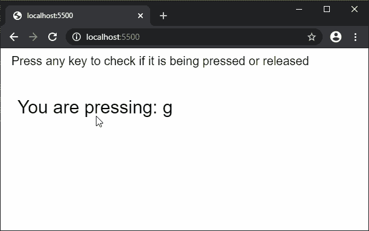

# p5.js | keyReleased()功能

> 原文:[https://www.geeksforgeeks.org/p5-js-keyreleased-function/](https://www.geeksforgeeks.org/p5-js-keyreleased-function/)

每当按下一个键时，调用**键释放()功能**。最近键入的 ASCII 键存储在“键”变量中，但是，它不区分大写和小写字符。非 ASCII 字符可以用它们各自的代码在“键码”变量中访问。

不同的浏览器可能会将自己的默认行为附加到某些键上。这可以通过在函数末尾添加“return false”来防止。

**语法:**

```
keyReleased()
```

**参数:**此方法不接受任何参数。

下面的例子说明了 p5.js 中的 **keyReleased()函数**:

**示例:**

```
function setup() {
  createCanvas(600, 200);
  textSize(20);
  text("Press any key to check if "
        + "it is being pressed or "
        + "released", 10, 20);
}

function keyPressed() {
  clear();
  textSize(20);
  text("Press any key to check if "
        + "it is being pressed or "
        + "released", 10, 20);
  textSize(30);

  text("You are pressing: " 
        + key, 20, 100);
}

function keyReleased() {
  clear();
  textSize(20);
  text("Press any key to check if "
        + "it is being pressed or "
        + "released", 10, 20);
  textSize(30);

  text("You released: "
        + key, 20, 100);
}
```

**输出:**


**环境设置:**

**参考:**T2】https://p5js.org/reference/#/p5/keyReleased