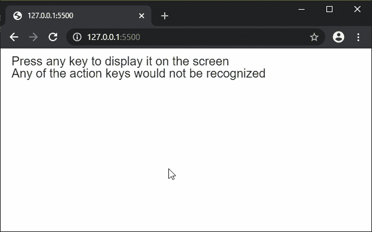

# P5 . js | KeyType()函数

> 原文:[https://www.geeksforgeeks.org/p5-js-keytyped-function/](https://www.geeksforgeeks.org/p5-js-keytyped-function/)

除了方向键、Ctrl、Shift、Alt、Backspace 和 Delete 键等操作键之外，每次按下一个键时都会调用 **keyTyped()功能**。最近键入的密钥存储在*“密钥”*变量中。

请注意，按住一个键可能会导致多次 keyTyped()调用。这是因为操作系统如何处理按键，并且取决于计算机的配置。浏览器可能会将自己的默认行为附加到各种键上，这可以通过在方法的末尾添加“return false”来防止。

**语法:**

```
keyTyped()
```

**参数:**此方法不接受任何参数。

下面的例子说明了 p5.js 中的**KeyType()函数**:

**示例:**

```
function setup() {
  createCanvas(600, 200);
  textSize(20);
  text("Press any key to display it on the screen", 10, 20);
  text("Any of the action keys would not be recognized", 10, 40);
}

function keyTyped() {
  clear();
  textSize(20);
  text("Press any key to display it on the screen", 10, 20);
  text("Any of the action keys would not be recognized", 10, 40);
  textSize(100);
  text(key, 100, 150);
}
```

**输出:**


**环境设置:**

**参考:**T2】https://p5js.org/reference/#/p5/keyTyped