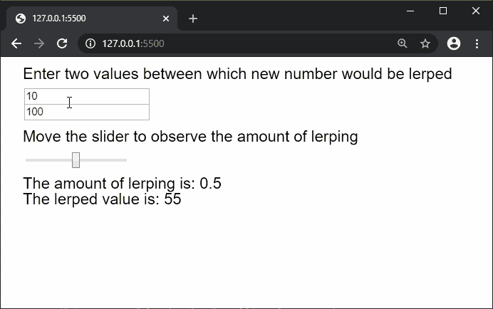
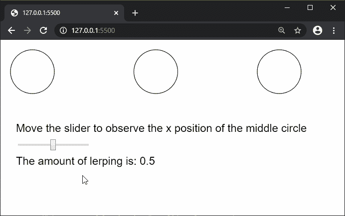

# p5.js | lerp()功能

> 原文:[https://www.geeksforgeeks.org/p5-js-lerp-function/](https://www.geeksforgeeks.org/p5-js-lerp-function/)

**lerp()函数**用于在两个数字之间寻找一个数字。amt 参数可用于指定两个值之间的插值量。接近 0.1 的量意味着最终值更接近第一值，接近 0.9 意味着该值更接近第二值。如果该值小于或大于这些值，则最终值将根据这两个数字的比率来计算。

它可以用于绘制虚线，或者通过找到一条线中的所有中间点来创建沿路径的运动。

**语法:**

```
lerp( start, stop, amt )
```

**参数:**该函数接受三个参数，如上所述，如下所述:

*   **start:** 是表示两个数的第一个值的数字。
*   **stop:** 是表示两个数的第二个值的数字..
*   **amt:** 它是一个数字，表示在两个数字之间插入一个数字的数量。

**返回值:**它返回一个具有设定值的数字。

下面的例子说明了 p5.js 中的 **lerp()函数**:

**例 1:**

```
function setup() {
  createCanvas(600, 200);
  textSize(20);

  inputElemA = createInput(10);
  inputElemA.position(30, 40);

  inputElemB = createInput(100);
  inputElemB.position(30, 60);

  sliderElem = createSlider(0, 1, 0.5, 0.1);
  sliderElem.position(30, 120);
}

function draw() {
  clear();
  text("Enter two values between which new "
        + "number would be lerped", 20, 20);
  text("Move the slider to observe the amount"
        + " of lerping", 20, 100);

  // Convert the string value to a number
  // value for lerping
  inputValA = Number(inputElemA.value());
  inputValB = Number(inputElemB.value());
  sliderVal = sliderElem.value();

  text("The amount of lerping is: "
        + sliderVal, 20, 160);

  text("The lerped value is: "
        + lerp(inputValA, inputValB, 
        sliderVal), 20, 180);
}
```

**输出:**


**例 2:**

```
function setup() {
  createCanvas(600, 300);
  textSize(20);

  sliderElem = createSlider(0, 1, 0.5, 0.1);
  sliderElem.position(30, 180);

  circleApos = 50;
  circleBpos = 500;
}

function draw() {
  clear();
  text("Move the slider to observe the x position "
          + "of the middle circle", 20, 160);

  circle(circleApos, 50, 80);
  circle(circleBpos, 50, 80);

  sliderVal = sliderElem.value();
  lerpedVal = lerp(circleApos, circleBpos, sliderVal);

  // Draw the circle at the lerped x coordinate
  circle(lerpedVal, 50, 80);

  text("The amount of lerping is: " + sliderVal, 20, 220);
}
```

**输出:**


**在线编辑:**[https://editor.p5js.org/](https://editor.p5js.org/)

**环境设置:**

**参考:**T2】https://p5js.org/reference/#/p5/lerp