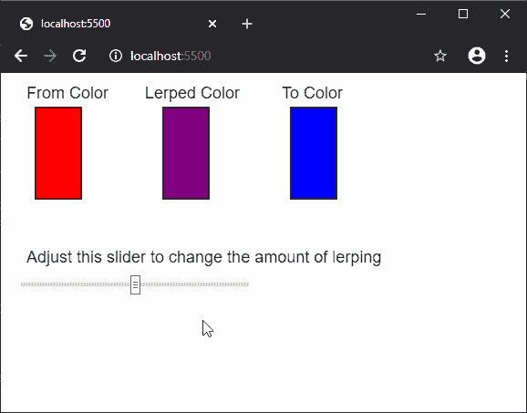

# p5.js | lerpColor()功能

> 原文:[https://www.geeksforgeeks.org/p5-js-lerpcolor-function/](https://www.geeksforgeeks.org/p5-js-lerpcolor-function/)

**lerpColor()** 函数用于插值两种颜色，以在它们之间找到第三种颜色。可以使用 *amt* 参数设置两种颜色之间的插值量。颜色插值取决于当前的颜色模式。

**语法:**

```
lerpColor(c1, c2, amt)
```

**参数:**该功能接受三个参数，如上所述，描述如下:

*   **c1:** 是 p5。代表最终颜色将被插值的第一种颜色。
*   **c2:** 是 p5。表示最终颜色将被插值到的第二种颜色的颜色。
*   **amt:** 它是一个介于 0 和 1 之间的数字，决定了哪种颜色将更多地用于插值。接近 0.1 的值更喜欢第一种颜色，接近 0.9 的值更喜欢第二种颜色用于插值。

**返回值:**返回 p5。具有插值颜色的颜色元素。

下面的例子说明了 p5.js 中的 **lerpColor()** 函数:

**示例:**

```
function setup() {
  createCanvas(500, 350);
  textSize(18);

  text("From Color", 20, 20);
  fromColor = color("red");

  text("Lerped Color", 150, 20);

  text("To Color", 300, 20);
  toColor = color("blue");

  text("Adjust this slider to change the"+
             " amount of lerping", 20,  200)
  alphaSlider = createSlider(0, 100, 50);
  alphaSlider.position(20, 220);
  alphaSlider.style('width', '250px');
}

function draw() {
  lerpedColor = lerpColor(fromColor, toColor, alphaSlider.value() / 100);

  fill(fromColor);
  rect(30, 30, 50, 100);

  fill(lerpedColor);
  rect(170, 30, 50, 100);

  fill(toColor);
  rect(310, 30, 50, 100);
}
```

**输出:**


**在线编辑:**[https://editor.p5js.org/](https://editor.p5js.org/)

**环境设置:**

**参考:**T2】https://p5js.org/reference/#/p5/lerpColor