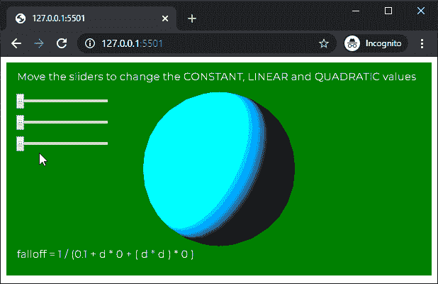

# P5 . js | LightFlower()函数

> 原文:[https://www.geeksforgeeks.org/p5-js-lightfalloff-function/](https://www.geeksforgeeks.org/p5-js-lightfalloff-function/)

p5.js 中的**灯光衰减()功能**用于设置场景中点光源的衰减。光衰减是指照明随着物体与点光源的距离而减少。它只影响在它之后创建的元素。以下等式用于计算衰减:

```
falloff = 1 / (CONSTANT + d * LINEAR + ( d * d ) * QUADRATIC)
```

其中 d 是从灯光位置到顶点位置的距离。该函数的默认值是光线衰减(1.0，0.0，0.0)。

**语法:**

```
lightFalloff( constant, linear, quadratic )
```

**参数:**该函数接受三个参数，如上所述，如下所述:

*   **常数:**这是一个数字，表示衰减方程中的常数值。
*   **线性:**这是一个数字，表示衰减方程中的线性值。
*   **二次的:**它是一个数字，表示衰减方程中的二次值。

下面的例子说明了 p5.js 中的**光照衰减()函数**:

**示例:**

```
let newFont;

function preload() {
  newFont = loadFont('fonts/Montserrat.otf');
}

function setup() {
  createCanvas(600, 300, WEBGL);
  textFont(newFont, 15);

  constantSlider = createSlider(0.1, 1, 0.1, 0.1);
  constantSlider.position(20, 50);

  linearSlider = createSlider(0, 0.01, 0, 0.0001);
  linearSlider.position(20, 80);

  quadraticSlider = createSlider(0, 0.0001, 0, 0.00001);
  quadraticSlider.position(20, 110);
}

function draw() {
  background('green');
  text("Move the sliders to change the CONSTANT, LINEAR"
          + " and QUADRATIC values", -285, -125);
  noStroke();
  shininess(15);

  constantValue = constantSlider.value();
  linearValue = linearSlider.value();
  quadraticValue = quadraticSlider.value();

  lightFalloff(constantValue, linearValue, quadraticValue);
  pointLight(0, 128, 255, -width / 2, -height / 2, 250);

  specularMaterial(250);
  sphere(100);

  text("falloff = 1 / (" + constantValue + " + d * " +
                    linearValue + " + ( d * d ) * " + 
                    quadraticValue + " )", -285, 125);
}
```

**输出:**


**在线编辑:**[https://editor.p5js.org/](https://editor.p5js.org/)

**环境设置:**

**参考:**T2】https://p5js.org/reference/#/p5/lightFalloff