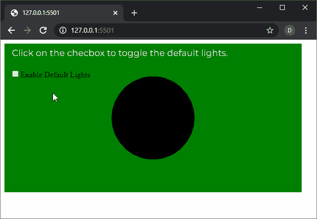
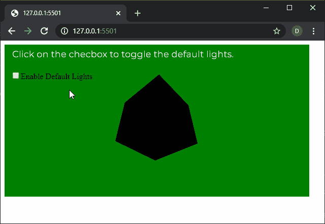

# p5.js |灯光()功能

> 原文:[https://www.geeksforgeeks.org/p5-js-lights-function/](https://www.geeksforgeeks.org/p5-js-lights-function/)

p5.js 中的**灯光()功能**用于设置场景中默认的环境光和方向光。使用的默认环境光是环境光(128，128，128)，方向光是方向光(128，128，128，0，0，-1)。此功能可用于在场景中快速添加默认灯光。

lights()函数必须在代码的 draw()函数中使用，以保持在场景中的持久性。

**语法:**

```
lights()
```

**参数:**此功能不接受任何参数。

下面的例子说明了 p5.js 中的**灯()功能**:

**例 1:**

```
let newFont;
let lightsEnable = false;

function preload() {
  newFont = loadFont('fonts/Montserrat.otf');
}

function setup() {
  createCanvas(600, 300, WEBGL);
  textFont(newFont, 18);

  lightsEnableCheck = createCheckbox(
      "Enable Default Lights", false);
  lightsEnableCheck.position(20, 60);

  // Toggle default light
  lightsEnableCheck.changed(() => {
    lightsEnable = !lightsEnable;
  });
}

function draw() {
  background("green");
  text("Click on the checbox to toggle the"
     + " default lights.", -285, -125);
  noStroke();
  shininess(15);
  specularMaterial(250);

  if (lightsEnable) {

    // Enable the default lights
    lights();
  }

  sphere(80);
}
```

**输出:**


**例 2:**

```
let newFont;
let lightsEnable = false;

function preload() {
  newFont = loadFont('fonts/Montserrat.otf');
}

function setup() {
  createCanvas(600, 300, WEBGL);
  textFont(newFont, 18);

  lightsEnableCheck = createCheckbox(
       "Enable Default Lights", false);

  lightsEnableCheck.position(20, 60);

  // Toggle default light
  lightsEnableCheck.changed(() => {
    lightsEnable = !lightsEnable;
  });
}

function draw() {
  background("green");
  text("Click on the checbox to toggle the"
       + " default lights.", -285, -125);
  noStroke();
  shininess(15);
  specularMaterial(250);

  if (lightsEnable) {

    // Enable the default lights
    lights();
  }

  rotateX(millis() / 1000);
  rotateY(millis() / 1000);
  box(100);
}
```

**输出:**


**在线编辑:**[https://editor.p5js.org/](https://editor.p5js.org/)

**环境设置:**

**参考:**T2】https://p5js.org/reference/#/p5/lights