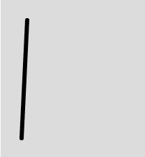
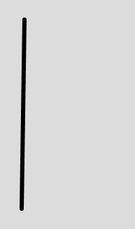

# p5.js | line()功能

> 原文:[https://www.geeksforgeeks.org/p5-js-line-function/](https://www.geeksforgeeks.org/p5-js-line-function/)

**line()函数**是 p5.js 中的一个内置函数，用来画线。为了改变线条的颜色，使用了 strokeWeight()函数，为了改变线条的宽度，使用了 strokeWeight()函数。

**语法:**

```
line(x1, y1, x2, y2)
```

或者

```
line(x1, y1, z1, x2, y2, z2)
```

**参数:**该功能接受六个参数，如上所述，描述如下:

*   **x1:** 该参数取第一点的 x 坐标。
*   **y1:** 该参数取第一点的 y 坐标。
*   **z1:** 该参数取第一点的 z 坐标。
*   **x2:** 该参数取第二点的 x 坐标。
*   **y2:** 该参数取第二点的 y 坐标。
*   **z2:** 该参数取第二点的 z 坐标。

下面的程序说明了 P5.js 中的 line()函数:

**示例 1:** 本示例使用 line()函数在不使用 z 坐标的情况下绘制直线。

```
function setup() {

    // Set the canvas size 
    createCanvas(400, 400);
}

function draw() {

    // Set the background color
    background(220);

    // Set the stroke weight
    strokeWeight(6);

    //x1, y1 = 38, 31; x2, y2 = 300, 20;
    // Use line() function to draw line
    line(38, 31, 30, 200); 
}
```

**输出:**


**示例 2:** 本示例使用 line()函数使用 z 坐标绘制直线。

```
function setup() {

    // Set the canvas size 
    createCanvas(400, 400);
}

function draw() {

    // Set the background color
    background(220);

    // Set the stroke weight
    strokeWeight(6);

    //x1, y1, z1 = 38, 31, 34; 
    // x2, y2, z2 = 300, 200, 45;
    // Use line() function to draw line
    line(38, 31, 34, 300, 200, 45); 
}
```

**输出:**


**参考:**T2】https://p5js.org/reference/#/p5/line