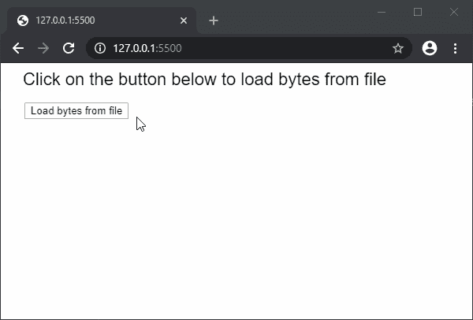

# p5.js | loadBytes()函数

> 原文:[https://www.geeksforgeeks.org/p5-js-loadbytes-function/](https://www.geeksforgeeks.org/p5-js-loadbytes-function/)

**loadBytes()函数**用于读取文件或网址的内容，并将其作为包含一系列字节的对象返回。然后可以使用对象的“bytes”属性来访问这些字节。文件必须存在于草图目录中才能访问。这种方法可以支持高达 64MB 的文件大小。

此函数是异步的，因此建议在 preload()函数中调用，以确保该函数先于其他函数执行。

**语法:**

```
loadBytes(file, [callback], [errorCallback])
```

**参数:**该函数接受三个参数，如上所述，如下所述:

*   **文件:**它是一个字符串，表示必须从中加载 XML 数据的文件路径或网址。
*   **回调:**是该函数执行成功时调用的函数。这个函数的第一个参数是从文件中加载的 XML 数据。这是一个可选参数。
*   **errorCallback:** 是一个函数，如果执行该函数时出现错误，就会调用该函数。这个函数的第一个参数是错误响应。这是一个可选参数。

**返回值:**返回一个对象，该对象的“字节”属性设置为从文件加载的字节。

下面的例子说明了 p5.js 中的 **loadBytes()函数**:

**示例:**

```
let loadedBytes = null;

function setup() {
  createCanvas(500, 300);
  textSize(22);

  text("Click on the button below to "
    + "load bytes from file", 20, 20);

  // Create a button for loading the XML
  loadBtn = createButton("Load bytes from file");
  loadBtn.position(30, 50)
  loadBtn.mousePressed(loadFileBytes);
}

function loadFileBytes() {

  // Load bytes from file
  loadedBytes = loadBytes('characters.txt', onFileload);
}

function onFileload() {
  text("Bytes loaded successfully...", 30, 100);

  // Print the bytes
  for (let i = 0; i < loadedBytes.bytes.length; i++)
    text(loadedBytes.bytes[i], 30 + i * 50, 150);
}
```

**输出:**


**环境设置:**

**参考:**T2】https://p5js.org/reference/#/p5/loadBytes