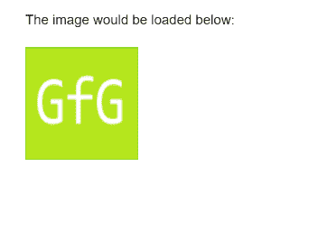
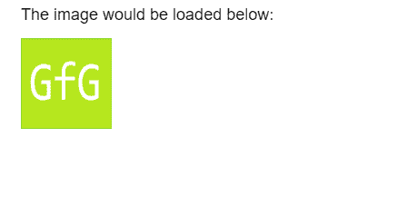

# p5.js | loadImage()函数

> 原文:[https://www.geeksforgeeks.org/p5-js-loadimage-function/](https://www.geeksforgeeks.org/p5-js-loadimage-function/)

**loadImage()** 函数用于从给定路径加载图像并创建 p5。带有图像的图像对象。

建议在**预加载()功能**中加载图像，因为加载的图像可能无法立即使用。图像最好从相对路径加载，因为由于浏览器的安全特性，某些浏览器可能会阻止从其他远程位置加载。

**语法:**

```
loadImage(path, successCallback, failureCallback)
```

**参数:**该函数接受三个参数，如上所述，如下所述。

*   **路径:**这是要加载图像的路径。
*   **successCallback:** 这是一个函数，如果图像加载成功就会调用这个函数，它是一个可选参数。
*   **failureCallback:** 这是一个函数，如果图像由于任何错误而没有加载，就会调用这个函数，它是一个可选参数。

下面的例子说明了 p5.js 中的 **loadImage()函数**:

**示例 1:** 该示例显示了预加载()中的图像加载。

```
let img;

function preload() {
  img = loadImage('sample-image.png');
}

function setup() {
  createCanvas(300, 200);

  text("The image would be loaded below:", 20, 20);
  image(img, 20, 40, 100, 100);
}
```

**输出:**



**示例 2:** 此示例显示了从 URL 加载图像以及可能发生的两次回调。

```
let img;
let url = 
'https://media.geeksforgeeks.org/wp-content/uploads/20190314004249/sample-image.png';

function setup() {
  createCanvas(400, 200);

  textSize(18)
  text("The image would be loaded below:", 20, 20);

  loadImage(url, img => {
    image(img, 20, 40, 100, 100);
  },
    (event) => {
      fill("red")
      text("Error: The image could not be loaded.", 20, 40);
      console.log(event);
    }
  );
}
```

**输出:**

*   **图像成功加载**
    
*   **图像不加载**
    

**在线编辑:**[【https://editor.p5js.org/】](https://editor.p5js.org/)
**环境设置:**[https://www . geeksforgeeks . org/P5-js-soundfile-object-installation-and-methods/](https://www.geeksforgeeks.org/p5-js-soundfile-object-installation-and-methods/)

**参考:**T2】https://p5js.org/reference/#/p5/loadImage