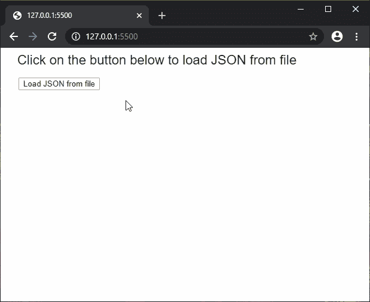
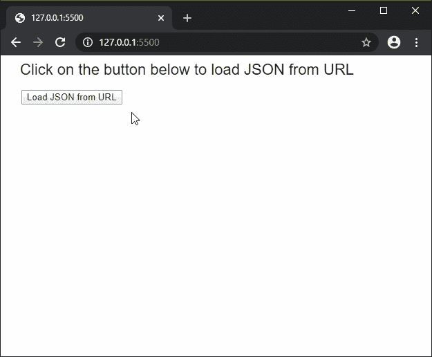

# p5.js | loadJSON()函数

> 原文:[https://www.geeksforgeeks.org/p5-js-loadjson-function/](https://www.geeksforgeeks.org/p5-js-loadjson-function/)

**loadJSON()函数**用于读取 JSON 文件或网址的内容，并将其作为对象返回。如果文件包含一个 JSON 数组，这个函数仍然会将它作为一个对象返回，索引号指定对象的不同键。这种方法可以支持高达 64MB 的文件大小。

此函数是异步的，因此建议在 preload()函数中调用，以确保该函数先于其他函数执行。

**语法:**

```
loadJSON(path, jsonpOptions, datatype, callback, errorCallback)
```

或者

```
loadJSON(path, datatype, callback, errorCallback)
```

或者

```
loadJSON(path, callback, errorCallback)
```

**参数:**该功能接受五个参数，如上所述，描述如下:

*   **路径:**这是一个字符串，表示要加载 JSON 的文件路径或网址。
*   **jsonpOptions:** 这是一个有“jsonp”相关设置选项的对象。这是一个可选参数。
*   **数据类型:**是指定 json 对象是“json”还是“jsonp”的字符串。这是一个可选参数。
*   **回调:**这是一个函数，当这个函数执行成功时被调用。这个函数的第一个参数是从文件中加载的数据。这是一个可选参数。
*   **errorCallback:** 这是一个函数，如果在执行该函数时出现任何错误，就会调用该函数。这个函数的第一个参数是错误响应。这是一个可选参数。

**返回值:**返回一个加载了 JSON 数据的对象。

下面的例子说明了 p5.js 中的 **loadJSON()函数**:

**例 1:**

```
let loadedJSON = null;

function setup() {
  createCanvas(500, 400);
  textSize(22);

  text("Click on the button below to load JSON from file", 20, 20);

  // Create a button for loading the JSON
  loadBtn = createButton("Load JSON from file");
  loadBtn.position(30, 50)
  loadBtn.mousePressed(loadJSONFile);
}

function loadJSONFile() {
  // Load the JSON from file
  loadedJSON = loadJSON('books.json', onFileload);
}

function onFileload() {
  text("File loaded successfully...", 30, 100);
  for (let i = 0; i < 3; i++) {
    text("Name: " + loadedJSON[i]["name"], 30, 140 + i * 80);
    text("Author: " + loadedJSON[i]["author"], 30, 160 + i * 80);
    text("Price: " + loadedJSON[i]["price"], 30, 180 + i * 80);
  }
}
```

**输出:**


**例 2:**

```
let loadedJSON = null;

function setup() {
  createCanvas(600, 300);
  textSize(22);

  text("Click on the button below to load JSON from URL", 20, 20);

  // Create a button for loading the JSON
  loadBtn = createButton("Load JSON from URL");
  loadBtn.position(30, 50)
  loadBtn.mousePressed(loadURL);
}

function loadURL() {

  // Load the JSON from API
  loadedJSON = loadJSON(
"https://jsonplaceholder.typicode.com/users/5", onURLload);
}

function onURLload() {
  text("ID: " + loadedJSON["id"], 30, 100);
  text("Name: " + loadedJSON["name"], 30, 120);
  text("Username: " + loadedJSON["username"], 30, 140);
  text("Email: " + loadedJSON["email"], 30, 160);

  text("Address City: " + loadedJSON["address"]["city"], 30, 200);
  text("Address Zipcode: " + loadedJSON["address"]["zipcode"], 30, 220);
}
```

**输出:**


**在线编辑:**[https://editor.p5js.org/](https://editor.p5js.org/)

**环境设置:**

**参考:**T2】https://p5js.org/reference/#/p5/loadJSON