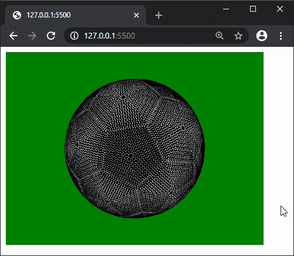

# p5.js | loadModel()函数

> 原文:[https://www.geeksforgeeks.org/p5-js-loadmodel-function/](https://www.geeksforgeeks.org/p5-js-loadmodel-function/)

**loadModel()** 函数用于从文件中加载三维模型，并将其作为 p5 返回。几何对象。该模型可以加载格式`.obj`或`.stl`。

OBJ 和 STL 加载的文件没有任何缩放感，因此可能需要使用规范化参数，以便模型自动缩放到正确的大小。加载模型后，可以使用 scale()函数进一步更改模型的大小。

这种方法本质上是异步的，因此在使用模型之前可能不会完成。因此，建议在预加载()函数中加载模型。

**语法:**

```
loadModel( path, normalize, [successCallback], [failureCallback] )
```

或者

```
loadModel(path, [successCallback], [failureCallback])
```

**参数:**该函数接受四个参数，如上所述，如下所述:

*   **路径:**它是一个字符串，表示模型加载的路径。
*   **normalize:** 它是一个布尔值，决定加载时加载的模型是否会缩放到标准大小。这是一个可选参数。
*   **successCallback:** 这是一个在模型加载成功的情况下调用的函数。加载的模型作为参数传递。这是一个可选参数。
*   **failureCallback:** 这是一个如果模型由于任何错误而没有加载时调用的函数。错误事件作为参数传递。这是一个可选参数。

**返回值:**返回 p5。给定模型的几何对象。

下面的程序说明了 p5.js 中的 **loadModel()** 函数:

**示例 1:** 此示例显示了如何在 preload()函数中加载模型。

```
let newObj;

function preload() {
  newObj = loadModel('models/ball.obj', true);
}

function setup() {
  createCanvas(400, 300, WEBGL);
}

function draw() {
  background('green');

  rotateZ(frameCount * 0.01);
  rotateX(frameCount * 0.01);

  model(newObj);
}
```

**输出:**


**示例 2:** 这个示例展示了如何使用回调来加载和使用模型。

```
let newModel;

function setup() {
  createCanvas(400, 300, WEBGL);
  noLoop();
  loadModel('models/ball.obj', true, modelLoaded, loadFailed);
}

function draw() {
  background('green');

  rotateZ(frameCount * 0.01);
  rotateX(frameCount * 0.01);
  model(newModel);

  loop();
}

function modelLoaded(modelObj) {
  newModel = modelObj;
  loop();
}

function loadFailed(error) {
  print("The model failed to load", error);
}
```

**输出:**


**参考:**T2】https://p5js.org/reference/#/p5/loadModel