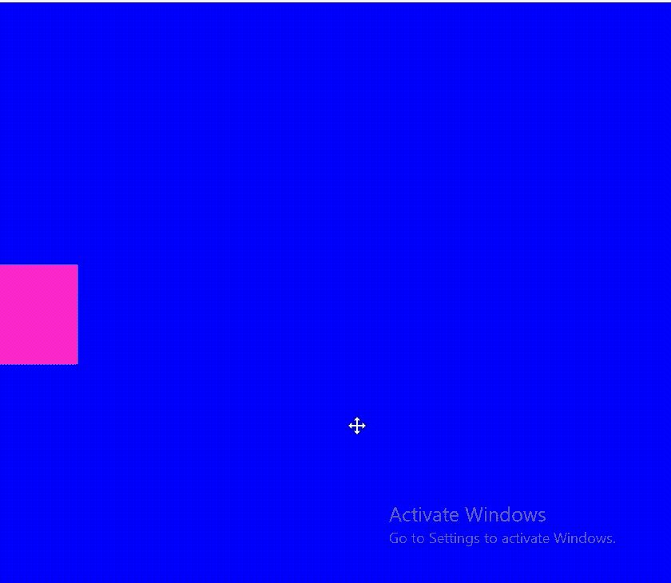

# p5.js loadShader()方法

> 原文:[https://www.geeksforgeeks.org/p5-js-loadshader-method/](https://www.geeksforgeeks.org/p5-js-loadshader-method/)

函数 **loadShader()** 从文件中加载着色器，并将它们作为变量中的 p5 着色器对象返回。文件扩展名可以是。glsl 或。着色器或顶点。

应该从预加载()中调用它 loadShader()。

#### 语法:

```
loadShader(vertFilename, fragFilename, [callback], [errorCallback])
```

#### 参数 **:**

*   **vertFilename** :字符串类型，包含包含顶点着色器源代码的文件路径。
*   **片段文件名**:字符串类型，包含包含片段着色器源代码的文件路径。
*   **回调:**是 loadShader 完成后执行的函数。成功后，着色器对象作为第一个参数传递。它是可选的。
*   **错误回调**:是 loadShader 内部出现错误时执行的函数。当出现错误时，错误作为第一个参数传递。它是可选的。

#### **返回:**

从提供的顶点和片段着色器文件创建的着色器对象。

**示例**:本示例展示了如何使用着色器绘制正方形。

## java 描述语言

```
// this variable will hold our shader object
let rectShader;

function preload(){

  rectShader = loadShader('base.vert', 'rect.frag');
}

function setup() {
  // shaders require WEBGL mode to work
  createCanvas(400, 400, WEBGL);
  noStroke();

}

function draw() {  
  // shader() sets the active shader with our shader
  shader(rectShader);

  // lets send the time and resolution to our shader
  rectShader.setUniform('resolution', [width, height]);
  rectShader.setUniform('time', frameCount * 0.1);

  // rect gives us some geometry on the screen
  rect(0,0,width, height);
}

function windowResized(){
  resizeCanvas(windowWidth, windowHeight);
}
```

## 基地，绿色

```
attribute vec3 aPosition;
attribute vec2 aTexCoord;

void main() {

 // Copy the position data into a vec4, using
 // 1.0 as the w component
 vec4 positionVec4 = vec4(aPosition, 1.0);

 // scale the rect by two, and move it to the 
 // center of the screen if we don't do this, 
 // it will appear with its bottom left corner 
 // in the center of the sketch try commenting 
 // this line out to see what happens
 positionVec4.xy = positionVec4.xy * 2.0 - 1.0;

 // Send the vertex information on to the fragment shader
 gl_Position = positionVec4;
}
```

## rect.frag

```
<pre>precision mediump float;

varying vec2 vTexCoord;

// We need the sketch resolution to perform
// some calculations
uniform vec2 resolution;
uniform float time;

// This is a function that turns an rgb value 
// that goes from 0 - 255 into 0.0 - 1.0
vec3 rgb(float r, float g, float b){
  return vec3(r / 255.0, g / 255.0, b / 255.0);
}

// this is the function that draws our rect
// it works just like rect in p5 except that
// it takes an additional color parameter at the end
vec3 rect (float x, float y, float w, float h, vec3 color){

  // in this example we will use gl_FragCoord which is a 
  // variable that just gives us pixel position as whole 
  // numbers, just like in p5
  vec2 coord = gl_FragCoord.xy;

  // we reverse the coords because in webGL 0,0 
  // is at the bottom left
  coord.y = resolution.y - coord.y;

  // one way we could make a rect is by using 
  // an if statement, however if statements are 
  // considered to be slow inside of shaders
  // instead we will use some math functions to calculate a rectangle
  // mix takes three values i.e. mix(option1, option2, edge)
  // option one will be chosen if edge equals zero
  // option two will be chose if edge equals one

  // the step function takes two arguments i.e. step(edge, val)
  // step returns 0.0 if val is less than edge
  // step returns 1.0 if val is greater than edge

  // using these two functions combined we can section 
  // off parts of the screen into black and white
  float width = 1.0 -mix(0.0, 1.0, step(x + w, coord.x));
  float xPos =  1.0 -mix(0.0, 1.0, step(x, coord.x));

  float height = 1.0 - mix(0.0, 1.0, step(y + h, coord.y));
  float yPos = 1.0 - mix(0.0, 1.0, step(y, coord.y));

  // create a color to use
  vec3 col = rgb(color.r, color.g, color.b);

  // calculate the final rectangle
  // we will multiply the x values against the y values
  //  to produce our final rect as black and white
  // the black and white mask is multiplied against our
  // color and returned.
  return  col * ((height - yPos) * (width - xPos));
}

void main() {

  // The width and height of our rectangle
  float width = 200.0;
  float height = 200.0;

  // The center of the screen is just the 
  // resolution divided in half
  vec2 center = resolution * 0.1;

  // lets make our rect in the center of the screen. 
  // We have to subtract half of it's width and height
  // just like in p5
  float x = center.x - width*0.6;
  float y = center.y - height*0.6;

  // a color for the rect 
  vec3 pink = vec3(255.0,99.0, 71.0);

  // a color for the bg
  vec3 blue = rgb(0.0, 0.0, 255.0);

  // lets add a sine wave to the x position so that 
  // it moves back and forth
  x += sin(time) *100.0;

  // call our rect function with the values we defined
  vec3 r = rect(x, y, width, height, pink);

  // now mix the rect with the background color
  // anything that is black in r will become the bg
  vec3 scene = mix(blue, r, r);

  // out put the final image
  gl_FragColor = vec4( scene ,4.0);
}
```

**输出:**


**参考:**[https://p5js.org/reference/#/p5/loadShader](https://p5js.org/reference/#/p5/loadShader)