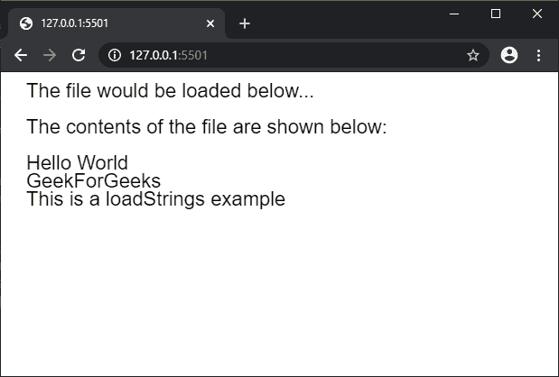

# p5.js | loadStrings()函数

> 原文:[https://www.geeksforgeeks.org/p5-js-loadstrings-function/](https://www.geeksforgeeks.org/p5-js-loadstrings-function/)

**loadStrings()函数**用于读取文件的内容，并用文件的每一行创建一个字符串数组。如果使用文件名，要读取的文件必须位于草图目录，否则，可以指定文件的 URL。

建议在 preload()函数中调用此函数，以确保该函数先于其他函数执行。

**语法:**

```
loadStrings( filename, callback, errorCallback )
```

**参数:**该函数接受三个参数，如上所述，如下所述:

*   **文件名:**这是一个字符串，表示文件的名称或加载文件的网址。
*   **回调:**这是函数成功执行后调用的函数。这个函数的第一个参数是字符串数组。
*   **errorCallback:** 这是一个函数，如果在执行该函数时出现任何错误，就会调用该函数。这个函数的第一个参数是错误响应。

下面的例子说明了 p5.js 中的 **loadStrings()函数**:

**例 1:**

```
let result;

function preload() {
    result = loadStrings("test_file.txt");
}

function setup() {
    createCanvas(600, 300);
    textSize(22);
}

function draw() {
    clear();
    text("The contents of the file "
        + "are shown below:", 20, 20);

    // Check if the strings array
    // is non-empty before displaying
    // the contents
    if (result.length > 0) {
        for (let i = 0; i < result.length; i++) {
            text(result[i], 20, 60 + i * 20);
        }
    }
    else {
        text("File is empty", 20, 60);
    }
}
```

**输出:**


**例 2:**

```
let result;

function setup() {
    createCanvas(600, 300);
    textSize(22);

    text("The file would be loaded"
            + " below...", 20, 20);

    result = loadStrings(
            "test_file.txt", fileLoaded);
}

function fileLoaded() {
    text("The contents of the file "
        + "are shown below:", 20, 60);

    // Check if the strings array
    // is non-empty before 
    // displaying the contents
    if (result.length > 0) {
        for (let i = 0; i < result.length; i++) {
            text(result[i], 20, 100 + i * 20);
        }
    }
    else {
        text("File is empty", 20, 60);
    }
}
```

**输出:**


**在线编辑:**[https://editor.p5js.org/](https://editor.p5js.org/)

**环境设置:**

**参考:**T2】https://p5js.org/reference/#/p5/loadStrings