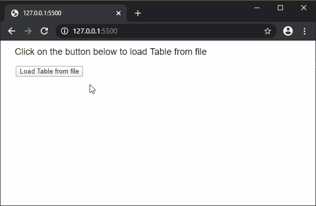
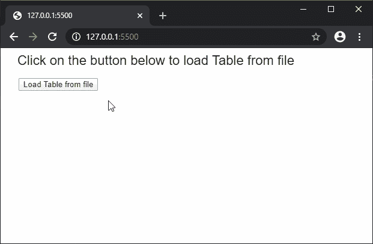

# p5.js | loadTable()函数

> 原文:[https://www.geeksforgeeks.org/p5-js-loadtable-function/](https://www.geeksforgeeks.org/p5-js-loadtable-function/)

**loadTable()函数**用于读取文件或网址的内容，并创建一个 p5。表对象。options 参数可用于定义数据预期读取的格式类型。所有加载和保存的文件都采用 UTF 8 编码。

此函数是异步的，因此建议在 preload()函数中调用，以确保该函数先于其他函数执行。

**语法:**

```
loadTable(filename, options, [callback], [errorCallback])
```

或者

```
loadTable(filename, [callback], [errorCallback])
```

**参数:**该函数接受四个参数，如上所述，如下所述。

*   **文件名:**这是一个字符串，表示必须从其中加载数据的文件路径或网址。
*   **选项:**它是一个字符串，表示要加载的文件的格式。它既可以是使用逗号分隔值加载表的“csv”，也可以是使用制表符分隔值加载表的“tsv”。还可以指定值“header”来表示该表是否有标题值。可以通过将多个命令作为单独的参数传递来使用它们。这是一个可选参数。
*   **回调:**这是一个函数，当这个函数执行成功时被调用。这个函数的第一个参数是从文件中加载的 XML 数据。这是一个可选参数。
*   **errorCallback:** 这是一个函数，如果在执行该函数时出现任何错误，就会调用该函数。这个函数的第一个参数是错误响应。这是一个可选参数。

下面的例子说明了 p5.js 中的 **loadTable()函数**:

**例 1:**

```
// Contents of books.csv

// Book One, Author One, Price One
// Book Two, Author Two, Price Two
// Book Three, Author Three, Price Three

let loadedTable = null;

function setup() {
  createCanvas(500, 300);
  textSize(18);

  text("Click on the button below to"+
       " load Table from file", 20, 20);

  // Create a button for loading the table
  loadBtn = createButton("Load Table from file");
  loadBtn.position(30, 50)
  loadBtn.mousePressed(loadFile);
}

function loadFile() {

  // Load the table from file
  loadedTable = loadTable('books.csv', 'csv', onFileload);
}

function onFileload() {
  text("Table loaded successfully...", 20, 100);

  // Display through the table
  for (let r = 0; r < loadedTable.getRowCount(); r++) {
    for (let c = 0; c < loadedTable.getColumnCount(); c++) {
      text(loadedTable.getString(r, c), 
            20 + c * 200, 150 + r * 20);
    }
  }
}
```

**输出:**


**例 2:**

```
// Contents of books_header.csv

// title, author, price
// Book One, Author One, Price One
// Book Two, Author Two, Price Two
// Book Three, Author Three, Price Three

let loadedTable = null;

function setup() {
  createCanvas(500, 300);
  textSize(22);

  text("Click on the button below to "
       + "load Table from file", 20, 20);

  // Create a button for loading the table
  loadBtn = createButton("Load Table from file");
  loadBtn.position(30, 50)
  loadBtn.mousePressed(loadFile);
}

function loadFile() {
  // Load the table from file with headers
  loadedTable = loadTable('books_header.csv',
                'csv', 'header', onFileload);
}

function onFileload() {
  text("Table loaded successfully...", 20, 100);

  // Display the headers
  for (let h = 0; h < loadedTable.getColumnCount(); h++) {
    text(loadedTable.columns[h], 20 + h * 200, 150);
  }

  textSize(16);
  // Display the data in the table
  for (let r = 0; r < loadedTable.getRowCount(); r++) {
    for (let c = 0; c < loadedTable.getColumnCount(); c++) {
      text(loadedTable.getString(r, c), 
            20 + c * 200, 170 + r * 20);
    }
  }
}
```

**输出:**


**在线编辑:**[https://editor.p5js.org/](https://editor.p5js.org/)

**环境设置:**

**参考:**T2】https://p5js.org/reference/#/p5/loadTable