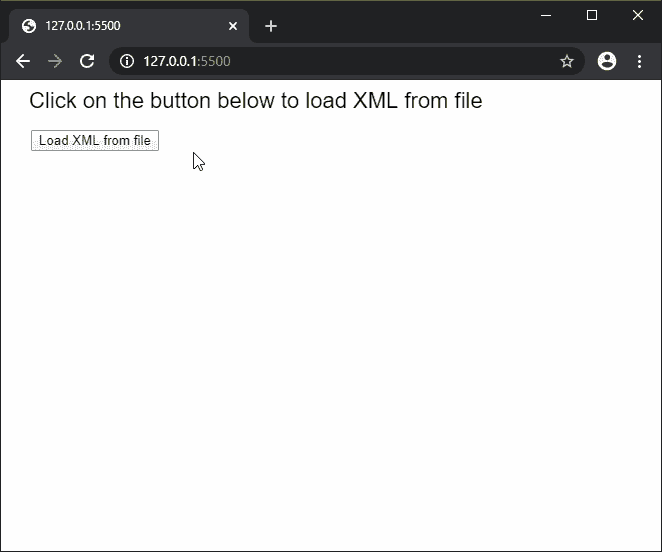
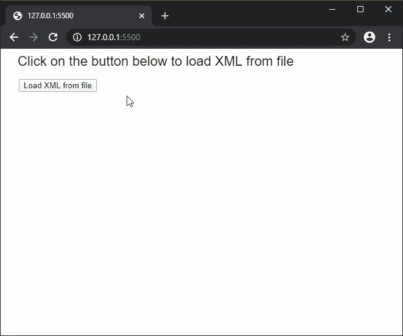

# p5.js | loadXML()函数

> 原文:[https://www.geeksforgeeks.org/p5-js-loadxml-function/](https://www.geeksforgeeks.org/p5-js-loadxml-function/)

**loadXML()函数**用于读取文件或 URL 的内容，并将其作为 XML 对象返回。文件必须存在于草图目录中才能访问。这种方法可用于支持高达 64MB 的文件大小。

此函数是异步的，因此建议在 preload()函数中调用，以确保该函数先于其他函数执行。

**语法:**

```
loadXML(filename, callback, errorCallback )
```

**参数:**该功能接受三个参数，如上所述，描述如下:

*   **文件名:**这是一个字符串，表示必须从中加载 XML 数据的文件路径或网址。
*   **回调:**这是一个函数，当这个函数执行成功时被调用。这个函数的第一个参数是从文件中加载的 XML 数据。这是一个可选参数。
*   **errorCallback:** 这是一个函数，如果在执行该函数时出现任何错误，就会调用该函数。这个函数的第一个参数是错误响应。这是一个可选参数。

下面的例子说明了 p5.js 中的 **loadXML()函数**:

**例 1:**

```
/* == Contents of books.xml ==

<book>
    <name>The Adventures of Sherlock Holmes: Part One</name>
    <author>Arthur Conan Doyle</author>
    <price>323</price>
    <genre>Detective fiction</genre>
</book>

*/

let loadedXML = null;

function setup() {
  createCanvas(500, 200);
  textSize(22);

  text("Click on the button below to "
       + "load XML from file", 20, 20);

  // Create a button for loading the XML
  loadBtn = createButton("Load XML from file");
  loadBtn.position(30, 50)
  loadBtn.mousePressed(loadXMLFile);
}

function loadXMLFile() {

  // Load the XML from file
  loadedXML = loadXML('books.xml', onFileload);
}

function onFileload() {
  text("XML loaded successfully...", 30, 100);
  let book = loadedXML.getChildren();

  // Get the content of the tags
  let name = book[0].getContent();
  let author = book[1].getContent();
  let price = book[2].getContent();
  let genre = book[3].getContent();

  text("Name: " + name, 30, 140);
  text("Author: " + author, 30, 160);
  text("Price: " + price, 30, 180);
  text("Genre: " + genre, 30, 200);
}
```

**输出:**


**例 2:**

```
/* == Contents of movies.xml ==

<movies>
    <movie year="1972" director="Francis Ford Coppola">
        The Godfather
    </movie>
    <movie year="1939" director="Victor Fleming">
        The Wizard of Oz
    </movie>
    <movie year="1941" director="Orson Welles">
        Citizen Kane
    </movie>
</movies>

*/

let loadedXML = null;

function setup() {
  createCanvas(500, 450);
  textSize(22);

  text("Click on the button below to "
        + "load XML from file", 20, 20);

  // Create a button for loading the XML
  loadBtn = createButton("Load XML from file");
  loadBtn.position(30, 50)
  loadBtn.mousePressed(loadXMLFile);
}

function loadXMLFile() {

  // Load the XML from file
  loadedXML = loadXML('movies.xml', onFileload);
}

function onFileload() {

  // Get the children with the "movie" tag
  let children = loadedXML.getChildren('movie');

  for (let i = 0; i < children.length; i++) {

    // Get the content of the tag
    let name = children[i].getContent();

    // Get a numerical attribute
    let year = children[i].getNum('year');

    // Get a string attribute
    let director = children[i].getString('director');

    text("Name: " + name, 30, 100 + i * 80);
    text("Year: " + year, 30, 120 + i * 80);
    text("Director: " + director, 30, 140 + i * 80);
  }
}
```

**输出:**


**在线编辑:**[https://editor.p5js.org/](https://editor.p5js.org/)

**环境设置:**

**参考:**T2】https://p5js.org/reference/#/p5/loadXML