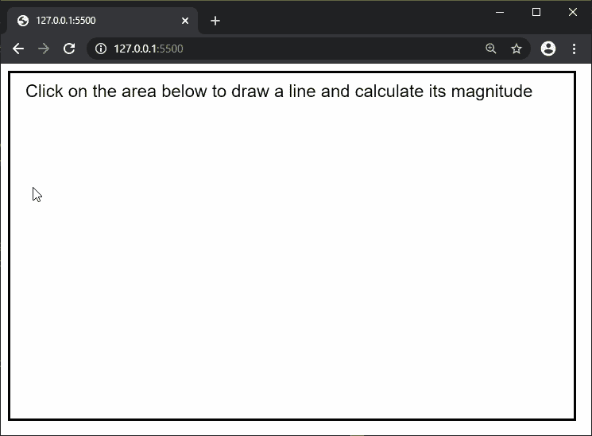

# p5.js | mag()功能

> 原文:[https://www.geeksforgeeks.org/p5-js-mag-function/](https://www.geeksforgeeks.org/p5-js-mag-function/)

p5.js 中的 **mag()函数**用来求向量的大小或长度。由于向量没有起始位置，因此大小是从位置(0，0)到(x，y)计算的。这相当于使用 dist(0，0，x，y)。

**语法:**

```
mag( a, b )
```

**参数:**该函数接受两个参数，如上所述，如下所述:

*   **a:** 是表示第一个值的数字，即矢量的“x”坐标。
*   **b:** 是表示第二个值的数字，即矢量的“y”坐标。

**返回值:**返回一个带有向量大小的数字。

以下示例说明了 p5.js 中的 **mag()功能**:

**示例:**

```
function setup() {
  createCanvas(650, 400);
  strokeWeight(5);
  rect(0, 0, width, height);
  textSize(20);

  text("Click on the area below to draw"
          + " a line and calculate its "
          + "magnitude", 20, 30);
}

function mousePressed() {
  strokeWeight(1);

  // Draw line to where the
  // mouse is clicked
  line(0, 0, mouseX, mouseY);

  // Calculate the line magnitude
  lineMag = mag(mouseX, mouseY);

  // Draw the magnitude text on
  // the end of the line
  text(lineMag, mouseX, mouseY);
}
```

**输出:**


**在线编辑:**[https://editor.p5js.org/](https://editor.p5js.org/)

**环境设置:**

**参考:**T2】https://p5js.org/reference/#/p5/mag