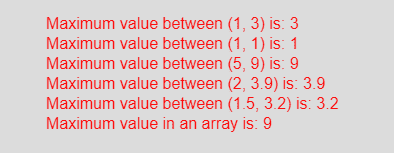

# p5.js | max()功能

> 原文:[https://www.geeksforgeeks.org/p5-js-max-function/](https://www.geeksforgeeks.org/p5-js-max-function/)

p5.js 中的 **max()函数**用于获取数列或两个给定数中的最大值。max()函数接受任意数量的参数或数组。
**语法:**

```
max(a, b)
```

或者

```
max(arr)
```

**参数:**max(a，b)函数接受两个不同个数的参数并进行比较，得到其中的最大值。max(arr)函数接受一个数字数组并返回最大值。
**返回值:**返回数字之间的最大值。
下面的程序说明了 p5.js 中的 max()函数:
**示例:**本示例使用 max()函数获取最大值。

## java 描述语言

```
function setup() {

    // Create Canvas of given size
    createCanvas(450, 230);
}

function draw() {

    // Set the background color
    background(220);

    // Call to max() function
    let u = max(1, 3);
    let v = max(1, 1);
    let w = max(5, 9);
    let x = max(2, 3.9);
    let y = max(1.5, 3.2);

    let arr = [1, 5, 3, 8, 6, 9];
    let z = max(arr);

    // Set the size of text
    textSize(16);

    // Set the text color
    fill(color('red'));

    // Getting maximum value   
    text("Maximum value between (1, 3) is: " + u, 50, 30);
    text("Maximum value between (1, 1) is: " + v, 50, 50);
    text("Maximum value between (5, 9) is: " + w, 50, 70);
    text("Maximum value between (2, 3.9) is: " + x, 50, 90);
    text("Maximum value between (1.5, 3.2) is: " + y, 50, 110);
    text("Maximum value in an array is: " + z, 50, 130);

}
```

**输出:**



**参考:**T2https://p5js.org/reference/#/p5/max