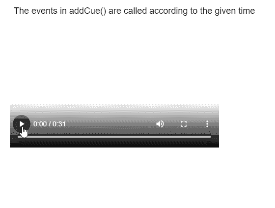
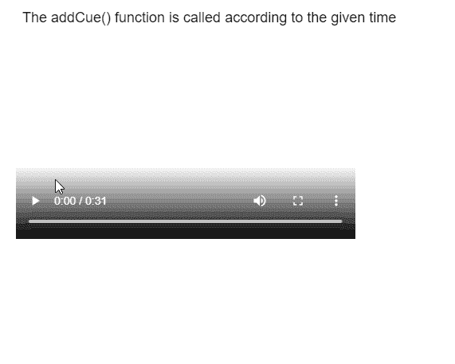

# p5.js MediaElement addCue()方法

> 原文:[https://www . geesforgeks . org/P5-js-media element-addcue-method/](https://www.geeksforgeeks.org/p5-js-mediaelement-addcue-method/)

**p5 的 **addCue()** 法。 **p5.js** 库的 MediaElement** 用于调度某个事件，每当媒体元素到达指定的提示点时触发。它接受一个回调函数，该函数可用于指定事件期间应该发生什么操作。还可以使用此方法将可选参数传递给回调函数。

**语法:**

```
addCue( time, callback, value)

```

**参数:**该函数接受三个参数，如上所述，如下所述。

*   **时间:**是一个数字，它指定了相对于媒体元素的时间(以秒为单位)，在该时间之后将调用给定的回调函数。
*   **回调:**它是一个会在给定时间被调用的函数。
*   **值:**是作为参数传递给回调函数的对象。这是一个可选参数。

**返回值:**这个方法返回一个数字，表示添加的提示的“id”。这可用于以后访问或移除提示。

**示例 1:** 以下示例说明了 **p5.js** 库的 **addCue()** 方法。

## java 描述语言

```
function setup() {
  createCanvas(550, 400);
  textSize(18);

  text("The events in addCue() are called " +
       "according to the given time", 20, 20);

  example_media =
    createVideo("sample-video.mp4");
  example_media.size(426, 240);
  example_media.position(20, 60);
  example_media.showControls();

  // Using the addCue() method for specifying
  // the time that the callback function
  // would be called
  example_media.addCue(3, showTime,
                       example_media);
  example_media.addCue(5, showTime,
                       example_media);
  example_media.addCue(8, showTime,
                       example_media);
  example_media.addCue(10, showTime,
                       example_media);
}

function showTime(media) {

  // Set a random background color
  r = random(255);
  g = random(255);
  b = random(255);
  background(r, g, b);

  // Get the media element from the callback
  let mediaTime = media.time();

  text("The current time of the video is: " +
       mediaTime, 20, 340);

    text("The events in addCue() are called " +
       "according to the given time", 20, 20);
}
```

**输出:**



**例 2:**

## java 描述语言

```
let y = 0;

function setup() {
  createCanvas(550, 400);
  textSize(18);

  text("The addCue() function is called " +
       "according to the given time", 20, 20);

  example_media =
    createVideo("sample-video.mp4");
  example_media.size(426, 240);
  example_media.position(20, 60);
  example_media.showControls();

  // Using the addCue() method for specifying
  // the time that the callback function
  // would be called
  example_media.addCue(3, changePlaySpeed,
                       0.15);
  example_media.addCue(5, changePlaySpeed,
                       1.0);
  example_media.addCue(8, changePlaySpeed,
                       3.0);
}

function changePlaySpeed(amount) {

  // Get the amount from the callback
  example_media.speed(amount);

  text("The current speed of the video is: "
       + amount, 20, y + 340);

  y += 20;
}
```

**输出:**



**在线编辑:**[【https://editor.p5js.org/】](https://editor.p5js.org/)
**环境设置:**[https://www . geeksforgeeks . org/P5-js-soundfile-object-installation-and-methods/](https://www.geeksforgeeks.org/p5-js-soundfile-object-installation-and-methods/)
**参考:**[https://p5js.org/reference/#/p5.MediaElement/addCue](https://p5js.org/reference/#/p5.MediaElement/addCue)