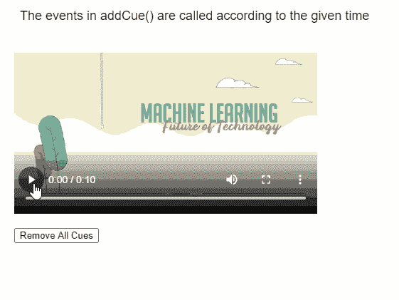

# P5 . js media element clear clues()方法

> 原文:[https://www . geesforgeks . org/P5-js-media element-clear clues-method/](https://www.geeksforgeeks.org/p5-js-mediaelement-clearcues-method/)

**p5 的**clear clues()**方法。 **p5.js** 库的 MediaElement** 用于清除媒体元素的所有当前已调度的提示，这些提示已经使用 **addCue()** 方法进行了调度。

**语法:**

```
clearCues()

```

**参数:**此功能不接受参数。

以下库包含在 HTML 文件的“头”部分，以便 JavaScript 函数工作。

> <脚本 src = " P5 . min . js "></脚本>

**示例:**下面的示例说明了 **p5.js** 库的**clear clues()**方法。

## java 描述语言

```
function setup() {
  createCanvas(550, 400);
  textSize(18);

  text("The events in addCue() are " +
       "called according to the given time",
       20, 20);

  example_media =
    createVideo("sample-video.mp4");
  example_media.size(426, 240);
  example_media.position(20, 60);

  example_media.speed(1.5);
  example_media.showControls();

  rmvBtn = 
    createButton("Remove All Cues");
  rmvBtn.position(20, 320);
  rmvBtn.mousePressed(removeCues)

  // Using the addCue() method for scheduling
  // the given callback functions
  example_media.addCue(3, changeColor);
  example_media.addCue(4, changeColor);
  example_media.addCue(5, changeColor);
  example_media.addCue(7, changeColor);
}

function removeCues() {
  clear();

  // Remove all cues associated with
  // the media element
  example_media.clearCues();

  text("All cues removed!", 20, 360);

  text("The clearCues() method removes " +
       "all the current cues", 20, 20);
}

function changeColor() {

  // Set a random background color
  r = random(100, 200);
  g = random(100, 200);
  b = random(100, 200);
  background(r, g, b);

  text("Background Color Changed!",
       20, 360);

  text("The events in addCue() are " +
       "called according to the given time",
       20, 20);
}
```

**输出:**



**在线编辑:**[【https://editor.p5js.org/】](https://editor.p5js.org/)
**环境设置:**[https://www . geeksforgeeks . org/P5-js-soundfile-object-installation-and-methods/](https://www.geeksforgeeks.org/p5-js-soundfile-object-installation-and-methods/)
**参考:**[https://p5js.org/reference/#/p5.MediaElement/clearCues](https://p5js.org/reference/#/p5.MediaElement/clearCues)