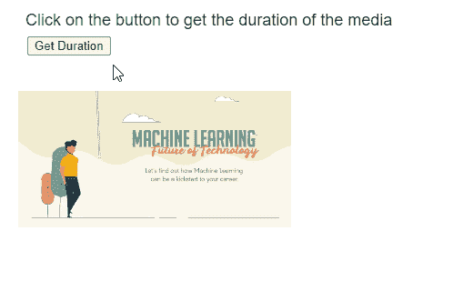

# p5.js MediaElement 持续时间()方法

> 原文:[https://www . geesforgeks . org/P5-js-media element-duration-method/](https://www.geeksforgeeks.org/p5-js-mediaelement-duration-method/)

p5 的**持续时间()**方法。 **p5.js** 库中的 MediaElement 用于返回调用它的媒体元素的持续时间。返回的持续时间以秒为单位显示。

**语法:**

```
 duration()

```

**参数:**此功能不接受任何参数。

**返回值:**该方法返回一个数字，表示媒体元素的当前时间。

实现以下示例时，以下库包含在 HTML 页面的“标题”部分。

> <脚本 src = " P5 . min . js "></脚本>

**示例:**下面的示例说明了 **p5.js** 库中的**持续时间()**方法。

## java 描述语言

```
function setup() {
    createCanvas(500, 300);

    textSize(18);

    example_media =
      createVideo("sample-video.mp4");
    example_media.size(300, 150);
    example_media.position(20, 100);
    example_media.play();

    text("Click on the button to get " +
         "the duration of the media", 20, 20);

    let durationBtn =
        createButton("Get Duration");
    durationBtn.position(30, 40);
    durationBtn.mousePressed(getDuration);
}

function getDuration() {

  // Get the duration of the media element
  let media_duration =
      example_media.duration();

  text("The duration of the media is: "
       + media_duration + " seconds",
       20, 280);
}
```

**输出:**



**在线编辑:**[【https://editor.p5js.org/】](https://editor.p5js.org/)
**环境设置:**[https://www . geeksforgeeks . org/P5-js-soundfile-object-installation-and-methods/](https://www.geeksforgeeks.org/p5-js-soundfile-object-installation-and-methods/)
**参考:**[https://p5js.org/reference/#/p5.MediaElement/duration](https://p5js.org/reference/#/p5.MediaElement/duration)