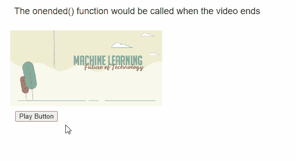

# p5.js MediaElement onended()方法

> 原文:[https://www . geesforgeks . org/P5-js-media element-onended-method/](https://www.geeksforgeeks.org/p5-js-mediaelement-onended-method/)

**p5 的**同】(**法。 **p5.js** 库中的 MediaElement** 用于调度给定的函数，每当音频或视频结束时，就会调用该函数。如果媒体元素正在循环，则不会调用此回调。此媒体元素作为参数传递给回调。

**语法:**

```
onended( callback )

```

**参数:**该函数接受一个参数，如上所述，如下所述。

*   **回调:**是指定媒体结束时的回调功能的函数。

以下库包含在 HTML 文件的“头”部分，以便 JavaScript 函数工作。

> <脚本 src = " P5 . min . js "></脚本>

下面的例子说明了 **p5.js** 库中的 **onended()** 方法

**示例:**

## java 描述语言

```
function setup() {
    createCanvas(550, 300);
    textSize(18);

    text("The onended() function would " +
         "be called when the video ends",
         20, 20);

    example_media =
      createVideo("sample-video.mp4");
    example_media.size(300, 150);
    example_media.position(20, 60);

    playBtn = createButton("Play Button");
    playBtn.position(30, 220);
    playBtn.mousePressed(() => {

      example_media.play();
    });

    // Using the onended() method
    example_media.onended(onendedShow);
}

function onendedShow(mediaElem) {

  // Get the media element from the callback
  let mediaSource = mediaElem.src;

  text("The media has ended playback!",
       20, 260);
  text("The source of the video is: " +
       mediaSource, 20, 280);
}
```

**输出:**



**在线编辑:**[【https://editor.p5js.org/】](https://editor.p5js.org/)
**环境设置:**[https://www . geeksforgeeks . org/P5-js-soundfile-object-installation-and-methods/](https://www.geeksforgeeks.org/p5-js-soundfile-object-installation-and-methods/)
**参考:**[https://p5js.org/reference/#/p5.MediaElement/onended](https://p5js.org/reference/#/p5.MediaElement/onended)