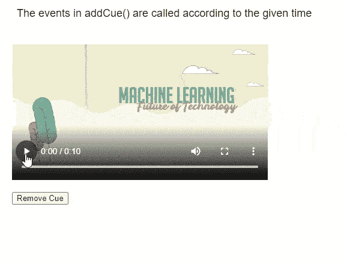
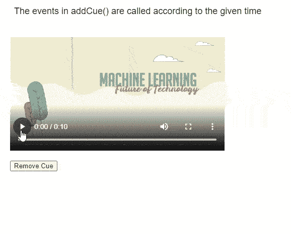

# p5.js MediaElement removeCue()方法

> 原文:[https://www . geesforgeks . org/P5-js-media element-remove cue-method/](https://www.geeksforgeeks.org/p5-js-mediaelement-removecue-method/)

p5 的 **removeCue()方法**。p5.js 中的 MediaElement 用于从 media element 中移除指定的提示。addCue()方法返回的 id 用于标识要移除的提示。

**语法:**

```
removeCue( id )

```

**参数:**该函数接受如上所述的单个参数，如下所述:

*   **id:** 它是一个数字，指定由 addCue 方法返回的提示的 id。

下面的例子说明了 p5.js 中的 **removeCue** ( **)方法**:

**例 1:**

## java 描述语言

```
function setup() {
  createCanvas(550, 400);
  textSize(18);

  text("The events in addCue() are " +
       "called according to the given time",
       20, 20);

  example_media =
    createVideo("sample-video.mp4");
  example_media.size(426, 240);
  example_media.position(20, 60);

  example_media.speed(2.0);
  example_media.showControls();

  rmvBtn = 
    createButton("Remove Cue");
  rmvBtn.position(20, 320);
  rmvBtn.mousePressed(removeCues)

  // Using the addCue() method for scheduling
  // the given callback functions
  cue_id =
    example_media.addCue(3, changeColor);
}

function removeCues() {

  clear();

  // Remove the cue associated with
  // the given ID
  example_media.removeCue(cue_id);

  text("Given cue removed!", 20, 360);

  text("The removeCue() method removes " +
       "the given cue", 20, 20);
}

function changeColor() {

  // Set a random background color
  r = random(100, 200);
  g = random(100, 200);
  b = random(100, 200);
  background(r, g, b);

  text("Background Color Changed!",
       20, 360);

  text("The events in addCue() are " +
       "called according to the given time",
       20, 20);
}
```

**输出:**



**例 2:**

## java 描述语言

```
let y = 0;

function setup() {
  createCanvas(550, 450);
  textSize(18);

  text("The events in addCue() are " +
       "called according to the given time",
       20, 20);

  example_media =
    createVideo("sample-video.mp4");
  example_media.size(426, 240);
  example_media.position(20, 60);

  example_media.speed(1.5);
  example_media.showControls();

  rmvBtn = 
    createButton("Remove Cue");
  rmvBtn.position(20, 320);
  rmvBtn.mousePressed(removeCues)

  // Using the addCue() method for scheduling
  // the given callback functions
  id1 = example_media.addCue(2, showCueNo, 1);
  id2 = example_media.addCue(4, showCueNo, 2);
  id3 = example_media.addCue(6, showCueNo, 3);
  id4 = example_media.addCue(8, showCueNo, 4);
}

function removeCues() {

  clear();

  // Remove the cue associated with
  // the given ID
  example_media.removeCue(id1);
  example_media.removeCue(id3);

  text("Given cues removed using the " +
       "removeCue() method", 20, 20);

  y = 0;
}

function showCueNo(cue_no) {

  text("This is cue number: " + cue_no,
       20, y + 360);

  y = y + 20;
}
```

**输出:**



**在线编辑:**[【https://editor.p5js.org/】](https://editor.p5js.org/)
**环境设置:**[https://www . geeksforgeeks . org/P5-js-soundfile-object-installation-and-methods/](https://www.geeksforgeeks.org/p5-js-soundfile-object-installation-and-methods/)
**参考:**[https://p5js.org/reference/#/p5.MediaElement/removeCue](https://p5js.org/reference/#/p5.MediaElement/removeCue)