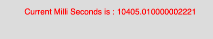

# p5.js | millis()功能

> 原文:[https://www.geeksforgeeks.org/p5-js-millis-function/](https://www.geeksforgeeks.org/p5-js-millis-function/)

p5.js 中的 **millis()函数**用于返回程序启动后的毫秒数。该功能主要用于定时事件和动画序列。

**语法:**

```
millis()
```

**参数:**函数不接受任何参数。

**返回值:**返回程序启动后的毫秒数。

下面的程序说明了 p5.js 中的 millis()函数:

**示例:**本示例使用 millis()函数返回从启动程序开始的毫秒数。

```
function setup() {

    // Create Canvas of size 450*80 
    createCanvas(450, 80);
}

function draw() {

    // Set the background color
    background(220);

    // Initialize the parameter with
    // current milliseconds
    let ml = millis();

    // Set the font size
    textSize(16);

    // Set the font color
    fill(color('red'));

    // Display result
    text("Current Milli Seconds is : "
                    + ml, 50, 30);
}                    
```

**输出:**


**参考:**T2】https://p5js.org/reference/#/p5/millis