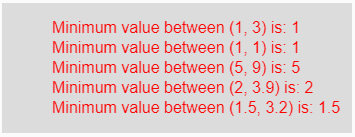

# p5.js | min()功能

> 原文:[https://www.geeksforgeeks.org/p5-js-min-function/](https://www.geeksforgeeks.org/p5-js-min-function/)

p5.js 中的 **min()函数**用于从数列中获取最小值。

**语法:**

```
min(a, b)
```

或者

```
min(arr)
```

**参数:**min(a，b)函数接受两个参数，这两个参数是两个不同的数字，并进行比较，以获得其中的最小值。min(arr)函数接受单个参数数组。

**返回值:**返回不同数字中的最小值。

下面的程序说明了 p5.js 中的 min()函数:

**示例:**本示例使用 min()函数获取最小值。

```
function setup() { 

    // Create Canvas of size 270*80 
    createCanvas(350, 130); 
} 

function draw() { 

    // Set the background color 
    background(220); 

    // Call to min() function 
    let u = min(1, 3);
    let v = min(1, 1);
    let w = min(5, 9);
    let x = min(2, 3.9);
    let y = min(1.5, 3.2);

    // Set the size of text 
    textSize(16); 

    // Set the text color 
    fill(color('red')); 

    // Getting minimum value    
    text("Minimum value between (1, 3) is: " + u, 50, 30);
    text("Minimum value between (1, 1) is: " + v, 50, 50);
    text("Minimum value between (5, 9) is: " + w, 50, 70);
    text("Minimum value between (2, 3.9) is: " + x, 50, 90);
    text("Minimum value between (1.5, 3.2) is: " + y, 50, 110);     
} 
```

**输出:**


**参考:**T2】https://p5js.org/reference/#/p5/min