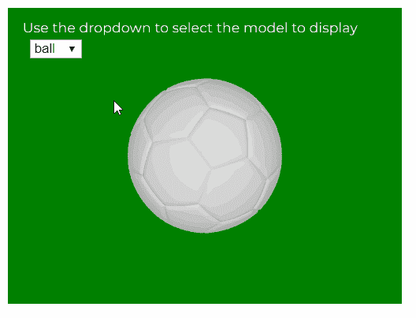

# p5.js | model()函数

> 原文:[https://www.geeksforgeeks.org/p5-js-model-function/](https://www.geeksforgeeks.org/p5-js-model-function/)

**模型()**功能用于将 3D 模型渲染到屏幕上。必须首先使用**加载模型()函数**加载要渲染的模型。

**语法:**

```
model( model )
```

**参数:**该函数接受一个参数，如上所述，如下所述。

*   **型号:**是 p5。几何对象，指定必须渲染到屏幕上的模型。

下面的程序说明了 p5.js 中的**模型()**功能:

**示例:**

```
let ballObj, cubeObj, coneObj;
let currentObj;
let newFont;

// Load all the models in preload()
function preload() {
  newFont = loadFont("fonts/Montserrat.otf");
  ballObj = loadModel("models/ball.obj", true);
  cubeObj = loadModel("models/cube.obj", true);
  coneObj = loadModel("models/cone.obj", true);
  currentObj = ballObj;
}

function setup() {
  createCanvas(400, 300, WEBGL);

  textFont(newFont, 14);

  modelSelector = createSelect();
  modelSelector.position(30, 40);
  modelSelector.option("ball");
  modelSelector.option("cube");
  modelSelector.option("cone");
  modelSelector.changed(modelChanged);
}

// Function to change the model depending
// on the selected dropdown 
function modelChanged() {
  let selected = modelSelector.value();
  console.log(selected);
  switch (selected) {
    case "ball":
      currentObj = ballObj;
      break;
    case "cube":
      currentObj = cubeObj;
      break;
    case "cone":
      currentObj = coneObj;
      break;
    default:
      break;
  }
}

function draw() {
  background("green");
  text("Use the dropdown to select the model to display", -185, -125);
  scale(0.75);
  lights();
  rotateX(frameCount * 0.05);
  rotateY(frameCount * 0.05);
  noStroke();

  // Load the given model
  model(currentObj);
}
```

**输出:**



**参考:**T2】https://p5js.org/reference/#/p5/model