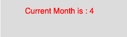

# p5.js |月()功能

> 原文:[https://www.geeksforgeeks.org/p5-js-month-function/](https://www.geeksforgeeks.org/p5-js-month-function/)

p5.js 中的**月()功能**用于*从系统时钟*中获取当前月份。

**语法**

```
month()

```

**参数:**函数不接受任何参数。

下面的程序说明了 p5.js 中的 month()函数:
**示例:**

```
function setup() {

    //create Canvas of size 270*80  
    createCanvas(270, 80);
}

function draw() {
    background(220);

    //initialize the parameter with month
    let m = month();
    textSize(16);
    fill(color('red'));
    text("Current Month is : " + m, 50, 30);
}
```

**输出:**


**参考:**T2】https://p5js.org/reference/#/p5/month