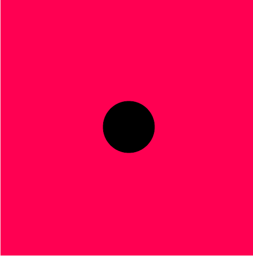
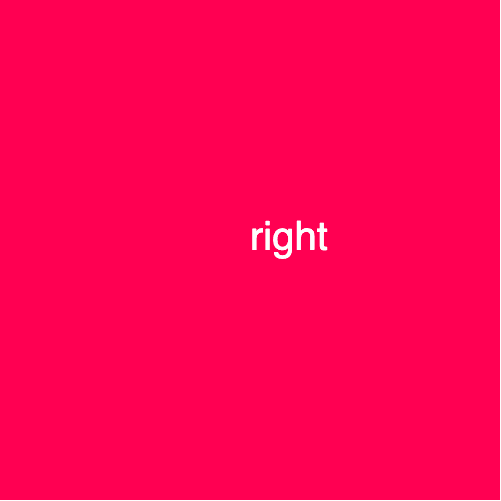

# p5.js |鼠标|鼠标按钮

> 原文:[https://www.geeksforgeeks.org/p5-js-mouse-mousebutton/](https://www.geeksforgeeks.org/p5-js-mouse-mousebutton/)

p5.js 中的 **mouseButton** 变量用于自动获取鼠标上按了哪种键。系统变量“鼠标按钮”的值可以是“左”、“右”或“中”，具体取决于最后按下的按钮。

**语法:**

```
mouseButton
```

下面的程序说明了 p5.js 中的 mouseButton 变量:

**示例 1:** 本示例使用 mouseButton 变量检测鼠标按钮。

```
function setup() {

    // Create canvas
    createCanvas(500, 500);
}

function draw() {

    // Set background color
    background(237, 34, 93);

    // Fill color
    fill(0);

    if (mouseIsPressed) {
        if (mouseButton === LEFT) {
            ellipse(height/2, width/2, 100, 100);
        }
        if (mouseButton === RIGHT) {
            rect(height/2, width/2, 100, 100);
        }
    }
}
```

**输出:**


**示例 2:** 本示例使用 mouseButton 变量检测鼠标按钮。

```
function setup() {

    // Create canvas
    createCanvas(500, 500);

    // Set the text size
    textSize(40); 
}

function draw() {

    // Set background color
    background(237, 34, 93);

    // Set the text color
    fill(255);

    // Check the status of the mouse
    if (mouseIsPressed) {
        text(mouseButton, height/2, width/2);
    }
}
```

**输出:**

**参考:**[https://p5js.org/reference/#/p5/mouseButton](https://p5js.org/reference/#/p5/mouseButton)