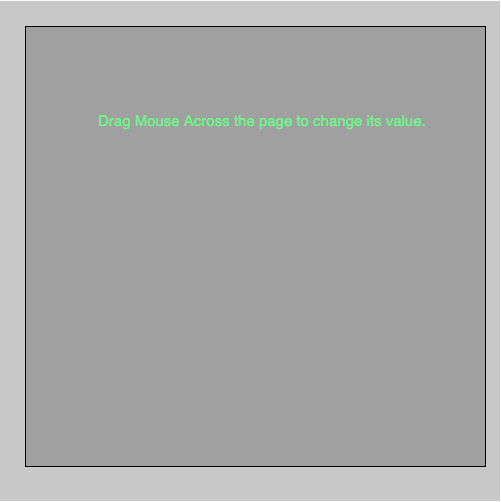
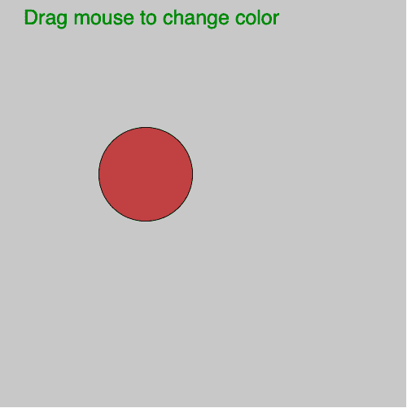

# p5.js |鼠标|鼠标拖动()功能

> 原文:[https://www . geesforgeks . org/P5-js-mouse-mouse dragged-function/](https://www.geeksforgeeks.org/p5-js-mouse-mousedragged-function/)

p5.js 中的**MouseDrawed()功能**用于检查鼠标拖动(鼠标移动和鼠标按钮按下)。每次鼠标拖动时都会调用它。如果没有定义**鼠标拖动()**功能，则使用 touchMoved()功能代替鼠标拖动()功能。

**语法:**

```
mouseDragged(Event)
```

下面的程序说明了 p5.js 中的 mouseDragged()函数:

**示例 1:** 本示例使用 mouseDragged()函数更改背景颜色。

```
function setup() {

    // Create Canvas
    createCanvas(500, 500);
}

let value = 0;

function draw() {

    // Set background color
    background(200);

    // Set filled color
    fill(value);

    // Create rectangle
    rect(25, 25, 460, 440);

    // Set text color
    fill('lightgreen');

    // Set font size
    textSize(15);

    // Display result
    text('Drag Mouse Across the page to change its value.',
        windowHeight/6, windowWidth/4);
}

function mouseDragged() {
    value = value + 5;

    if (value > 255) {
        value = 0;
    }
}
```

**输出:**


**示例 2:** 本示例使用 mouseDragged()函数更改鼠标光标的圆圈颜色。

```
let value;

function setup() {

    // Create Canvas
    createCanvas(500, 500);
}

function draw() {

    // Set background color
    background(200); 

    // Set filled color
    fill('green');

    // Set text and text size
    textSize(25);

    text('Drag mouse to change color', 30, 30);

    // Fill color according to
    // mouseMoved() function
    fill(value, 255-value, 255-value);

    // Draw ellipse  
    ellipse(mouseX, mouseY, 115, 115);
}

function mouseDragged() {
    value = mouseX%255;
}
```

**输出:**


**参考:**T2】https://p5js.org/reference/#/p5/mouseDragged